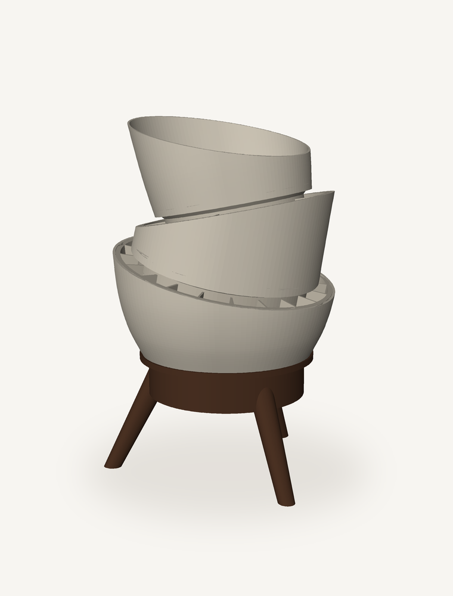
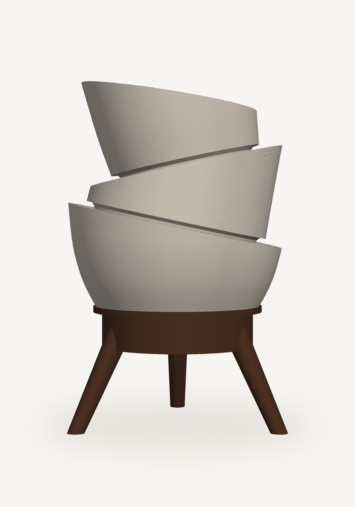
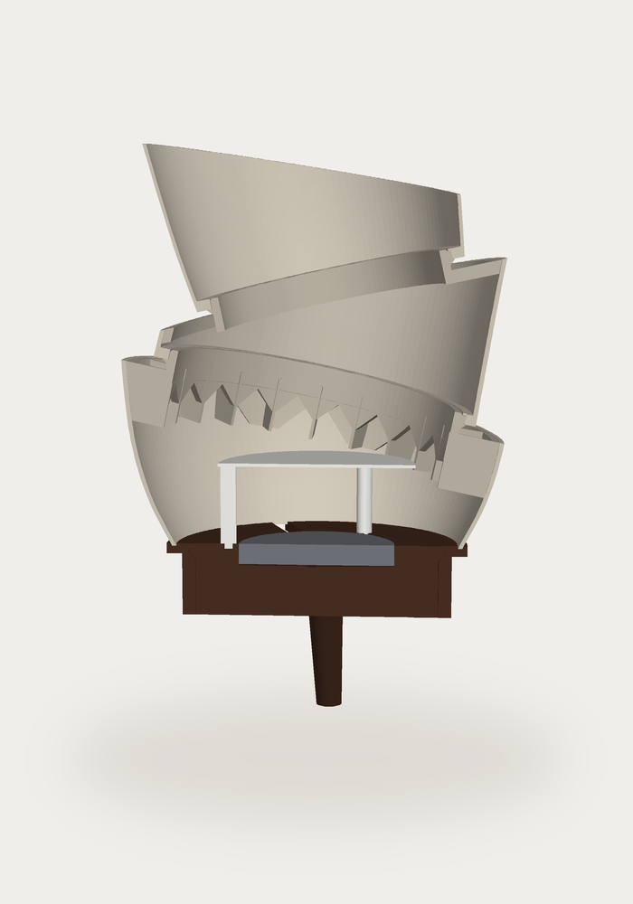
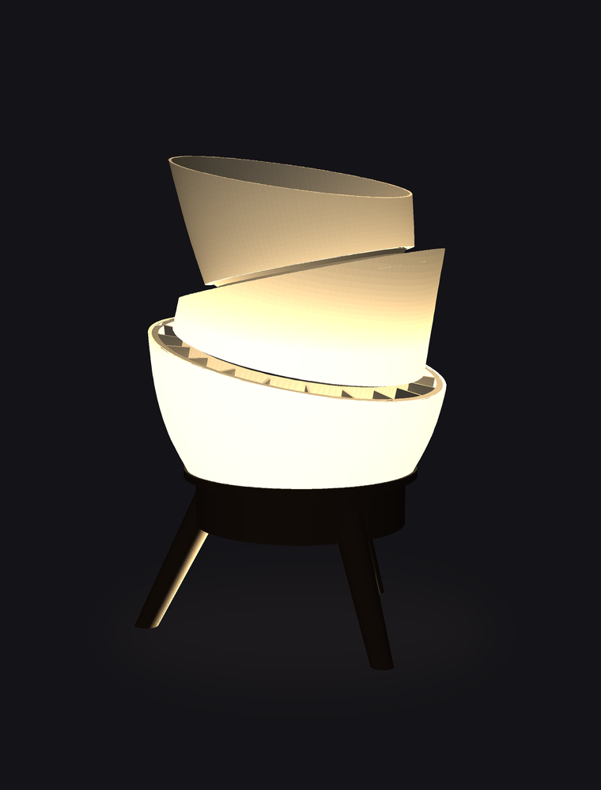
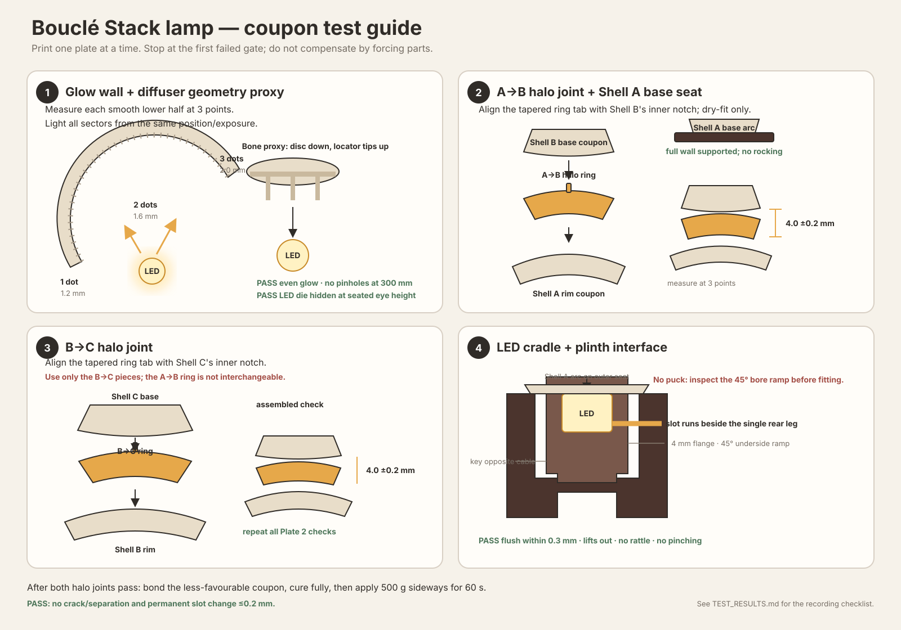
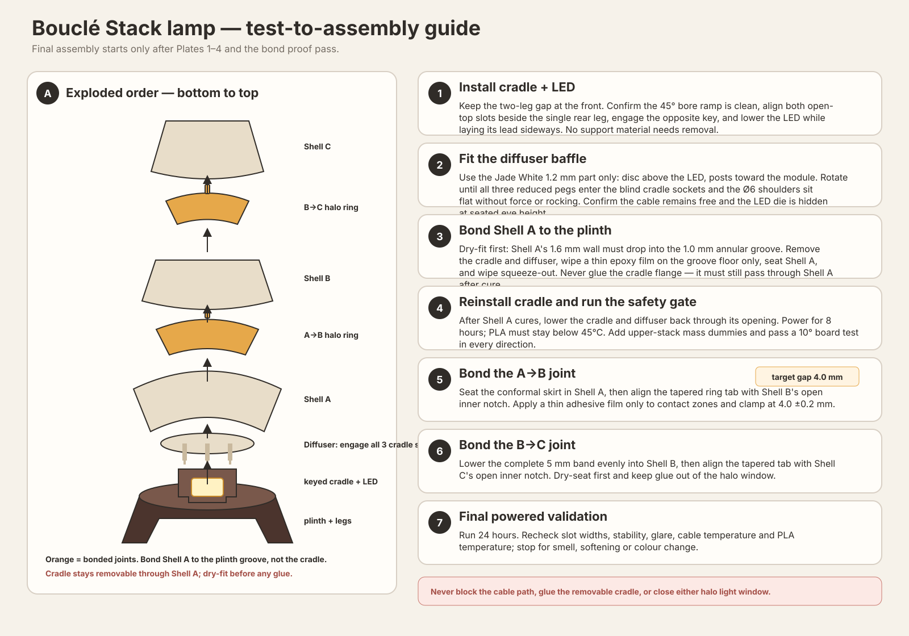

# Bouclé Stack — table lamp

A stacked-bowl table lamp for the **Bambu Lab LED Lamp Kit-001**, with fuzzy
Bambu PLA Matte shells standing in for bouclé fabric and a hidden PLA Basic
diffuser.

Status: **ready-to-print eight-plate complete lamp package + physical-gate
coupons + assembly preview + Autodesk Fusion mesh package.** Production
provides one combined P2S 3MF plus individual fallback projects. Every plate
contains one object, eliminating the inter-object travel strings observed on
the coupon plates.



Visual reference: the fabric stacked-bowl lamp posted by `@gekku.id` on
Instagram — three tilted bouclé shells on a splayed walnut tripod. Not
committed to the repo; treated as mood, not as geometry to copy.

## Files

- Concept sheet: [`boucle-stack-lamp-concept.svg`](./boucle-stack-lamp-concept.svg)
- Geometry: [`backend/generator/boucle_lamp_config.py`](../../backend/generator/boucle_lamp_config.py)
- Concept sheet script: [`scripts/generate_lamp_concept_svg.py`](../../scripts/generate_lamp_concept_svg.py)
- Coupon generator: [`backend/generator/boucle_lamp_coupons.py`](../../backend/generator/boucle_lamp_coupons.py)
- Production shade generator: [`backend/generator/boucle_lamp_shade.py`](../../backend/generator/boucle_lamp_shade.py)
- Combined eight-plate P2S project:
  [`production/Boucle_Stack_Lamp_All_Plates_P2S.3mf`](./production/Boucle_Stack_Lamp_All_Plates_P2S.3mf)
- Ready-to-print instructions: [`production/README.md`](./production/README.md)
- Test/assembly guide generator: [`scripts/generate_lamp_guides.py`](../../scripts/generate_lamp_guides.py)
- Assembly preview: [`backend/generator/boucle_lamp_assembly.py`](../../backend/generator/boucle_lamp_assembly.py)
- Autodesk Fusion export: [`fusion/Boucle_Stack_Lamp_Autodesk_Fusion_Package.zip`](./fusion/Boucle_Stack_Lamp_Autodesk_Fusion_Package.zip)
- Fusion export generator: [`backend/generator/boucle_lamp_fusion.py`](../../backend/generator/boucle_lamp_fusion.py)
- Preview renderer: [`scripts/render_lamp_preview.py`](../../scripts/render_lamp_preview.py)

Regenerate from the repository root:

```bash
python3 scripts/generate_lamp_concept_svg.py
.venv/bin/python scripts/generate_lamp_guides.py
.venv/bin/python backend/generator/boucle_lamp_coupons.py --out design/boucle-stack-lamp/coupons
.venv/bin/python backend/generator/boucle_lamp_shade.py --out design/boucle-stack-lamp/production
.venv/bin/python backend/generator/boucle_lamp_assembly.py --out design/boucle-stack-lamp/assembly
.venv/bin/python backend/generator/boucle_lamp_fusion.py --out design/boucle-stack-lamp/fusion
.venv/bin/python scripts/render_lamp_preview.py
```

`boucle_lamp_config.py` owns every number. It resolves the stack by chaining
shells — each shell's base plane, lean and base diameter are derived from the
shell below — and refuses to build if any shell exceeds a 45° outward overhang
when printed base-down. The concept sheet and the coupons both import it, so
the drawing and the meshes cannot drift apart.

## The idea

Three shells of revolution, each cut by an oblique plane. The next shell's axis
is the **normal of that plane**, so the stack zig-zags ±12°. The two
consequences that make this worth building:

1. **Every shell prints flat on its own base plane with no supports.** The lean
   is an assembly fact, not a print fact. In its print orientation each shell is
   an ordinary upward-flaring bowl.
2. **The joints become light.** Holding each shell 4 mm off the one below opens
   a continuous slot that follows the oblique plane, so the lamp reads as two
   glowing crescents wrapping the body plus a soft glow through the walls.

## Resolved geometry

| Part           | Base Ø | Widest Ø | Rim Ø | Wall low | Wall high | Lean | Local cut | Draft |
| -------------- | -----: | -------: | ----: | -------: | --------: | ---: | --------: | ----: |
| A · lower bowl |  112.0 |    149.9 | 149.8 |     40.8 |      71.9 |   0° |       12° | 28.3° |
| B · wedge      |  125.8 |    125.8 | 134.7 |     10.2 |      65.0 | +12° |       24° |    0° |
| C · upper bowl |  103.7 |    117.1 | 121.6 |     22.9 |      66.5 | −12° |       21° |  8.4° |

- Overall height **235.0 mm**, widest **Ø149.9 mm**, foot-centre circle **Ø156 mm**
- Wall low / high = axial wall height on the short and tall side of each shell
- Local cut = the oblique angle as printed; draft = worst outward overhang
- Shell bases are inset 12 mm (A→B) and 15.5 mm (B→C) inside the rim below. The
  inset does three jobs: it sets the wide–narrow–wide rhythm, it absorbs the
  fact that a lower rim is an ellipse while an upper base is a circle, and it
  gives a crisp shadow reveal at each joint.

B→C is 15.5 mm rather than the nominal 12 because shell B tapers inward along
its oblique rim. The earlier validator sampled only its wider short side and
reported 12.7 mm concealment at a 14 mm inset; the actual long-side minimum was
10.8 mm. `joint_recess()` now samples the complete short→long interval. The new
minimum is 12.34 mm, and `build_stack()` fails if either joint drops below
12 mm anywhere around its rim.

## Parts

| #   | Part            | Colour         | Notes                                           |
| --- | --------------- | -------------- | ----------------------------------------------- |
| 1   | Leg frame       | Dark Chocolate | Tripod + plinth ring, printed inverted, legs up |
| 2   | LED cradle      | Dark Chocolate | Drops into plinth; three diffuser sockets       |
| 3   | Shell A         | Bone White     | Fuzzy painted                                   |
| 4   | Shell B         | Bone White     | Fuzzy painted                                   |
| 5   | Shell C         | Bone White     | Fuzzy painted, 1.2 mm optical wall              |
| 6   | Halo ring ×2    | Bone White     | Hidden structural joint, sets the 4 mm gap      |
| 7   | Diffuser baffle | Jade White     | Ø76 × 1.2 mm, three posted locator pegs         |

### Base

The Ø104 × 28 mm plinth body sits at Z54–82. Its final 4 mm steps outward to a
**Ø116 top seat** with a **1.0 mm annular locate groove** for Shell A's Ø112 ×
1.6 mm base wall. The outer groove wall clears the shell's flare at groove
depth (±0.25 mm per side), giving a controlled glue film and stopping slide
while the epoxy cures. Bond Shell A only to this fixed seat — never to the
removable cradle. The cradle's Ø99 flange still passes through Shell A's
Ø108.8 opening for service. The first concept omitted
the seat lip: the shell wall was entirely outside the Ø104 plinth wall and
would have been unsupported. The seat is 4 mm rather than 2 mm to match the
removable cradle flange. In the inverted print, the cradle recess ends in only
a 0.8 mm inward step; the outer 0.6 mm of the cradle flange bears there, while
the Ø94 bore opens below through a 1.9 mm-high 45° ramp. This removes the
unsupported full-width shoulder without any sacrificial puck.

Three tapered legs (Ø16 → Ø10) splay 26° to a Ø156 foot circle. Each leg now
continues through its visible outer-wall contact to an embedded endpoint, so no
slanted end cap or shallow tangent joint remains. The hidden leg material is
clipped outside the Ø94 cradle bore, preserving removal clearance. The complete
frame is one watertight body with zero modelled cradle overlap. It prints
**inverted** — top seat on the bed, legs pointing up — so the outward step does
not bridge.

The LED cradle is a separate Ø93.6 × 28 mm plug with a **Ø99 × 4 mm retaining
flange**. Its body runs in the Ø94 bore on 0.4 mm total clearance; the flange
locates in a Ø99.4 recess, stops on the narrow outer land at Z78 and finishes
flush at Z82. Immediately below it, the body expands to Ø97.4 on a 1.9 mm-high
45° ramp that mirrors the plinth ramp with 0.2 mm radial clearance. Only a
0.8 mm radial lip starts at the flange layer, eliminating the former 2.7 mm
unsupported ledge. It can lift out for service but cannot fall through the
plinth.
An 8 mm anti-rotation key opposite the cable fixes the cradle orientation, so
the two cable slots cannot rotate out of alignment and pinch the lead. The
complete cable path is at 110°, 20° beside the single rear leg at 90°, so the
gap between the two front legs (210° and 330°) remains visually open. The key
stays opposite the cable at 290°. Its radial depth grows at 45° over the first
2 mm of flange height, then remains full-depth for 2 mm, avoiding a second
cantilever while retaining the same Plate 7 notch.

The cradle carries a **Ø60.4 × 8.5 mm pocket**, an uninterrupted Ø40 flat pad
for the supplied double-sided tape and a **6.8 mm open-top radial cable slot**.
The matching plinth slot is also open to the top: lower the LED into the pocket
while laying its attached lead sideways into both slots. The inline switch and
USB plug remain outside throughout; nothing is threaded through the printed
parts. Generic
radial screw slots were removed because they crossed and weakened that known
tape surface while still failing to prove the unmeasured screw locations. Real
blind pilots can be added after hardware measurement. A matching 6.8 × 5.3 mm
notch now continues through the plinth wall; the earlier channel ended against
solid plastic. Shell A drops into the plinth locate groove and is bonded there,
independently of the removable cradle. Three Ø3.6 × 2.4 mm blind sockets at R34
positively
locate the diffuser. They retain 2.0 mm of material to the LED pocket, use
0.6 mm total diametral peg clearance, and sit well clear of the cable slot. The
19.5 mm cradle floor
prints with five top/bottom layers around a 15% gyroid core and contributes
some ballast; whether more mass is needed remains a full-assembly tip-test
result.

> Hardware preflight is mandatory before Plate 4. The current EU listing gives
> D59 × H8 while Bambu's supplied drawing rounds the diameter to Ø60; the pocket
> therefore uses the larger Ø60 envelope. Measure the actual module, screw
> centres, material below each screw head and cable/strain-relief envelope. Do
> not use the supplied BT3×12 screws until safe engagement is known; the Ø40
> tape is the provisional primary retention.

### Halo rings

The visible 4 mm slot cannot carry load, so each joint gets a hidden ring. Both
upper shells include a 4 mm internal locating ledge. Each ring is
built in the **upper** shell's frame, which is the one frame where the whole
joint is a stack of parallel planes: the lower shell's oblique rim, the 4 mm
slot and the upper shell's base are all perpendicular to that axis.

A→B carries the larger upper-stack load on a continuous **22 mm-deep conformal
bond skirt**. Its straight lower edge replaces the ten scarfed glue tabs whose
triangular shadows were visible through Shell A in the first lit assembly.
Twenty 1.2 mm straight **radial webs** join a bed-rooted central **collar**
without the former scalloped crown or light-blocking funnel.

Shell B's short side is only 10.2 mm, so B→C remains shallow: its complete
5 mm band leaves 1.2 mm above the 4 mm lower register. A narrow collar passes
through the A→B bore and five evenly distributed bed-rooted webs connect it to
the band.
Complete-stack booleans check all ten shell/ring pairs; the largest numerical
contact is 0.0013 mm³, below the 0.01 mm³ tolerance, while preserving the
original silhouette.

Each ring carries one outward skirt tab that drops into an open rim notch in
the lower shell (Shell A for A→B, Shell B for B→C). The 3.0 × 0.55 × 4.0 mm
joint-frame tab and nominal 3.8 × 0.9 mm notch sit at shell-frame phase 36°,
with 0.8 mm tangential clearance, 0.35 mm radial clearance and 0.7 mm of wall
remaining behind the notch. Because the key tilts into each shell, the short
conformal notch measures 4.32 mm wide on Shell A and 4.74 mm on Shell B. It
follows the tapered inner wall and opens only through the local oblique rim,
rather than cutting a channel between the shell's global short and long sides.
That gives a positive hand-align before bonding without a long visible seam or
floating slicer region.

To remove the last rotational guess when gluing the upper shell, each collar
also carries one hidden 3.0 × 1.0 × 3.2 mm tapered clocking tab. It enters a
3.8 × 1.4 mm open-bottom notch in Shell B or C's internal register. The fit
keeps 0.8 mm total tangential clearance, 0.4 mm radial clearance, 0.8 mm top
clearance and 2.6 mm of register material behind the notch. One key per
interface avoids the binding risk of several over-constrained dot pins; all
four features remain support-free and invisible after assembly.

Both architectures leave the annulus between collar and shell wall open at slot
height — a minimum 10.7 mm light window at each joint. The seat sits 12.26 mm
and 12.34 mm inboard
of the outer surface, so it stays in shadow at both joints.

Both rings print bed-rooted with the upper shell's axis vertical. A→B's
continuous skirt, central collar and twenty straight spokes begin on the bed.
B→C's five 1.6 mm radial webs keep its collar and complete outer band joined
at every layer. Studio generates no bridge, overhang-wall or support feature
for either ring.

Joints are **bonded** (CA or plastic epoxy). The 0.25 mm fit only locates the
parts; the clocking tab only fixes rotation; and the ring carries the
cantilever. A magnet variant was considered and rejected — the stack leans, so
a demountable joint would have to resist a constant moment.

### Baffle

The LED module is a 3 W disc pointing straight up, and the top of the stack is
open — without a baffle you look directly at the dies. The first preview used a
shallow Ø76 dome, but its underside was only about 18° above horizontal and was
not support-free.

The production replacement is a **Ø76 × 1.2 mm PLA Basic Jade White diffuser
disc with three Ø6 × 30 mm posts** at R34. Each post ends in a reduced Ø3 ×
2 mm locating peg. Six 0.20 mm layers keep the disc flat while passing
materially more light than the former Matte reflector. It prints disc-down
with the posts and pegs growing vertically, then flips for assembly. The pegs
drop into the cradle's three blind sockets while the Ø6 shoulders land on the
cradle top, maintaining the full 30 mm optical stand-off without glue or a
loose gravity-only placement. It blocks direct die glare, leaves a 30 mm radial
light path and needs no support.

## Assembly preview

`boucle_lamp_assembly.py` puts every part where it lands in the finished lamp
and writes it out three ways. It is a **visualisation, not a print layout** —
the shells float 4 mm apart on their halo rings and nothing here would print as
arranged. The 3MF is one locked-together multipart object with eight named
volumes. They must not be emitted as separate top-level objects: Bambu Studio
automatically drops each top-level object to Z=0 and collapses the lamp into a
pile.

```text
design/boucle-stack-lamp/assembly/
  Boucle_Stack_Lamp_Assembly.3mf     open in Bambu Studio to orbit it
  boucle_stack_lamp_assembly.glb     coloured, for Quick Look / any glTF viewer
  boucle_stack_lamp_assembly.stl     single merged solid, printed parts only
  assembly.json                      part list, volumes, overall dimensions
  preview_*.png                      renders
```

It builds from the same `boucle_lamp_config` numbers and calls the production
shell and ring builders, so the preview cannot show a lamp the generator would
not produce. It runs at 132 sections and every sixth profile sample; printed
parts use 288 sections and the full profile.

| Elevation                                      | Half section                               | Lit                                |
| ---------------------------------------------- | ------------------------------------------ | ---------------------------------- |
|  |  |  |

The half section is the useful one: it shows A→B's straight continuous bond
skirt, straight spokes and central collar, B→C's shallow band, and the annulus
at slot height that feeds each halo.

The lit render is an illustration, not a simulation —
[`scripts/render_lamp_preview.py`](../../scripts/render_lamp_preview.py) is a
painter's-algorithm rasteriser with a point light at the LED and a
per-part transmission fudge standing in for translucency. It is right about
_where_ light escapes and only roughly right about how much. Two things it
does suggest and the glow coupon should confirm:

- The gradient bottom-to-top remains visible, but the Jade White diffuser and
  1.2 mm Shell C raise central Shell C output from about 6.0 to 9.2 lm. Total
  modelled output is roughly 136 lm.
- The reinforced A→B ring is ~49 cm³ with a genuinely open lower bore. The
  shallow B→C ring is ~18 cm³; its complete band, central collar and five
  bed-rooted webs now mirror A→B's outer design language.

## Autodesk Fusion export

[`fusion/Boucle_Stack_Lamp_Autodesk_Fusion_Package.zip`](./fusion/Boucle_Stack_Lamp_Autodesk_Fusion_Package.zip)
contains all eight production parts plus the LED-module reference at full
288-section resolution. The assembled OBJ preserves nine named, watertight
mesh bodies and colours; the assembled 3MF embeds millimetre units; individual
OBJ files and a Fusion Python importer create one named component per part.
See [`fusion/README.md`](./fusion/README.md) for import steps.

This is an exact mesh interchange package, not a native parametric `.f3d` or
analytic STEP model. Fuzzy skin remains Bambu slicer metadata, so the three
shells appear smooth in Fusion. The package is an assembly/editing reference,
not a replacement print layout.

## Print notes

Bambu Lab P2S and a 0.4 mm nozzle. The production package ships as one
eight-plate 3MF plus eight standalone fallbacks: shells A/B/C, the A→B and B→C
rings, the diffuser, the inverted leg frame and the removable LED cradle.
Plates 1–5 use Bone White Matte, Plate 6 uses Jade White PLA Basic, and Plates
7–8 use Dark Chocolate Matte. Every plate contains one object and all eight
slice without support.

The single-object plates are intentional. The coupons printed successfully
but repeatedly left fine strings during long travels between separate arcs.
Production therefore has no inter-object travel, and explicitly uses 0.8 mm /
30 mm/s retraction, layer-change retraction, 2 mm wipe and avoid-crossing-wall
travel. The combined 3MF sets `reduce_infill_retraction_mode` to `Disabled`
project-wide because Studio ignores per-object values for this setting. The
ring, leg-frame and cradle fallbacks also disable it; stock `Auto` omitted
retraction on long internal detours in the sliced G-code.

Plate 7 must keep generated support off. Its inverted Shell A groove closes
across only ~2.6 mm and the cradle stop steps inward by only 0.8 mm. A physical
support-enabled print strung inside the inset; G-code analysis found that all
unretracted travels over 5 mm were support moves. The support-free plate uses
20 mm/s bridge speed, and every model travel of at least 5 mm retracts.

Print the Jade White diffuser from Plate 6. Any earlier Matte coupon baffle or
pre-socket production diffuser/cradle is superseded.

- Shell A/B walls are **1.6 mm**; Shell C is **1.2 mm**. All use Arachne with a
  0.40 mm target width, four requested walls and 0% sparse infill. Shell C keeps
  the original reinforced 4 mm base/register geometry, so the existing B→C ring
  remains compatible.
- Seam **random**. A vertical seam line on a lit wall is very visible, and the
  fuzz already breaks up the surface.
- Outer wall slowed to 60 mm/s so the coarse fuzz stays even.
- 8 mm outer brim on every part. Each shell contacts the bed on a narrow
  1.6 mm annulus.

### Fuzzy skin

Painted per-triangle in the 3MF, the same mechanism as the Cooper panel in
[`backend/generator/paint_fuzzy_skin.py`](../../backend/generator/paint_fuzzy_skin.py) —
`fuzzy_skin: none` at object level ("None (allow paint)") with
`paint_fuzzy_skin="4"` on the selected triangles.

| Setting                     | Value                                 |
| --------------------------- | ------------------------------------- |
| `fuzzy_skin_thickness`      | 0.30 mm                               |
| `fuzzy_skin_point_distance` | 0.80 mm                               |
| `fuzzy_skin_first_layer`    | off                                   |
| Painted                     | Outer wall of shells A / B / C        |
| Excluded                    | 4 mm band at every rim, all interiors |

This deliberately uses a coarse ceramic/sandstone grain rather than dense
bouclé fuzz. The 0.30 mm displacement leaves approximately 1.30 mm on Shells
A/B and 0.90 mm on Shell C at the deepest points. Interiors, both 4 mm edge
bands, and all precision ring surfaces remain smooth.

## Physical gates

Nothing gets printed at full size until these pass. They ship as one four-plate
project, but **do not print all four plates at once**:

```text
design/boucle-stack-lamp/coupons/
  Boucle_Stack_Lamp_Coupons_P2S.3mf
  COUPON_TEST_GUIDE.svg
  ASSEMBLY_GUIDE.svg
  dimensions_and_acceptance.json
  TEST_RESULTS.md
  meshes/*.stl
```

Open the diagrams full-size before printing:





| Plate | Contents                                                   | AMS slot           | Layer       |
| ----- | ---------------------------------------------------------- | ------------------ | ----------- |
| 1     | Glow wall + diffuser geometry/glare proxy                  | 1 · Bone White     | 0.20        |
| 2     | A→B joint (three 100° arcs) + shell A base-seat arc        | 1 · Bone White     | 0.20 / 0.16 |
| 3     | B→C joint (three 100° arcs)                                | 1 · Bone White     | 0.20 / 0.16 |
| 4     | Production LED cradle + full-height plinth interface gauge | 2 · Dark Chocolate | 0.20        |

Each plate is single-filament, so the prime tower is off. Bambu Studio CLI
slices all four with zero warnings and no generated support. Plate 4's gauge
prints with the production top seat on the bed; the cradle prints pocket-up.

The joint coupons still prove the 0.25 mm skirt clearance, 4 mm slot, upper
register and bonded interfaces. Their small arcs do not reproduce the
production rings' full circumferences or complete web/collar architectures;
inspect projects 04–05 before dry assembly.

0. **Hardware preflight — no print.** Measure the actual MH001 diameter, total
   height, screw-hole centres, material under the screw heads and cable
   envelope. Plate 4 is blocked until those agree with the configuration.
1. **Print Plate 1 only: glow wall + diffuser.** The wall is a 150° arc at R72,
   stepped 1.2 / 1.6 / 2.0 mm across three dot-coded sectors and fuzzy on its
   upper half.
   Measure each smooth wall at three points; target nominal ±0.15 mm. Under the
   same LED position and dark-room exposure, choose the thinnest sector with
   even light and no pinholes visible from 300 mm. Fit the baffle over the LED
   and confirm no LED die is visible at seated eye height; repeat that glare
   check with the final Jade White project-06 diffuser. The 1.6 mm sector gates
   Shells A/B; the 1.2 mm sector must independently show no pinholes or
   unacceptable weakness before printing the brighter Shell C.
2. **Print Plate 2: A→B and base arc.** Dry-fit without force or rocking. The
   assembled slot must be **4.0 ±0.2 mm at three points**, and the ring must stay
   hidden at eye level. Keep the shell A base arc for Plate 4's seat test.
3. **Print Plate 3: B→C.** Repeat the complete fit/slot inspection. This joint
   has a different radius, 21° local cut and different ring; the A→B coupon
   cannot validate it.
4. **Print Plate 4 only after hardware preflight.** The cradle must enter the
   complete 28 mm bore by hand, stop on its flange, finish flush within 0.3 mm,
   show no obvious lateral rattle and lift out again. Keep the switch and USB
   plug outside; lower the LED while laying the attached lead sideways into the
   two aligned open-top slots. Confirm the lead is not pinched. Align the shell
   A arc over the local 6.8 mm seat interruption and confirm it bridges without
   rocking or damage.
5. **Bond proof.** Use the intended adhesive on the less favourable halo
   coupon, allow the maker's full cure time, then apply a 500 g lateral load for
   60 seconds. Pass only with no separation/crack and no permanent slot change
   over 0.2 mm.
6. **Mass-dummy stability gate before shells B/C.** The three feet form a
   triangular support polygon; comparing the rim to the Ø156 foot-centre circle
   is not a valid tipping calculation. Use sliced masses and mass dummies at the
   upper-part centres of mass, then require no tip on a 10° board in every
   orientation before spending filament on B/C.
7. **Powered thermal gates.** Run the reusable base/cradle/baffle/Shell A for
   eight hours before printing B/C, then the complete lamp for a 24-hour burn-in.
   PLA around the LED must remain below 45°C with no smell, softening, colour
   change or cable heating.

Acceptance criteria and every driving dimension are written to
`dimensions_and_acceptance.json` alongside the 3MF.

### Coupon print settings

Bambu Lab P2S, 0.4 mm nozzle, stock `Bambu PLA Matte @BBL P2S` filament preset —
no custom filament profile, because Studio cannot resolve one and silently drops
the real temperature and flow values with it.

|                  | Shell parts     | Halo ring       | Base parts  |
| ---------------- | --------------- | --------------- | ----------- |
| Layer height     | 0.20 mm         | 0.16 mm         | 0.20 mm     |
| Wall generator   | Arachne         | Classic         | Classic     |
| Wall line width  | **0.40 mm**     | 0.42 mm         | 0.42 mm     |
| Wall loops       | 6               | 4               | 4           |
| Infill           | 10% gyroid      | 15% gyroid      | 15% gyroid  |
| Outer wall speed | 80 mm/s         | 120 mm/s        | 150 mm/s    |
| Seam             | random          | aligned         | aligned     |
| Ironing          | —               | —               | cradle only |
| Brim             | 5 mm outer only | 5 mm outer only | auto        |

The shell coupons use Arachne with a 0.40 mm target width. Classic walls inserted
gap infill on 262 of 265 glow-coupon layers despite the nominal 3 / 4 / 5-bead
math. Arachne confines the remaining gap-fill moves to the 3 mm
foot/identification-dot layers, the baffle post tops and the glow coupon's top
cap; there is none in the open 3–53 mm vertical optical-wall interval. Because
Arachne varies bead width, caliper measurements and light quality—not assumed
perimeter counts—are the acceptance gate.

Ironing on the cradle is for the LED module's tape pad — it needs a flat pocket
floor to stick to. The interface gauge explicitly disables ironing because its
measured top seat is printed against the build plate.

## Decisions

| Decision        | Choice                                                      |
| --------------- | ----------------------------------------------------------- |
| Joint treatment | 4 mm halo slots — the lamp reads as light, not as fabric    |
| Shell colour    | Bone White Matte; hidden diffuser uses PLA Basic Jade White |
| Fixing          | Bonded, no magnets                                          |
| Size            | 235 mm tall as drawn                                        |
| Next step       | Print the eight plates in the combined production project   |

Still open:

- **Open or capped top.** Open gives uplight and shows the interior; a
  translucent cap makes the top rim glow. Deferred until the glow coupon shows
  how much light actually reaches shell C.
- **LED screw dimensions.** Measure screw spacing, head geometry and safe
  engagement on the actual kit before adding any screw pilots.
