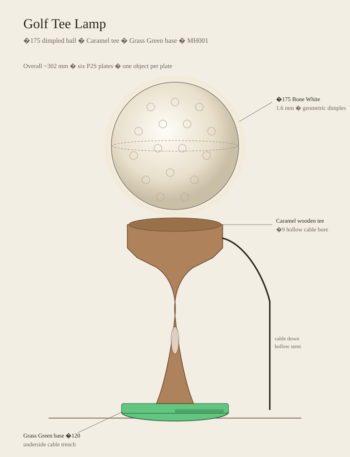

# Golf Tee Lamp

A sculptural **golf ball on a tee** for the **Bambu Lab LED Lamp Kit-001**.
Ø175 **Jade White** translucent ball (solid 1.6 mm shell, constant-thickness
dimples), **Caramel Matte** tee with **Ø5 filleted bayonet pins** and lock
detents, **Ivory** reflector cup, and a **Grass Green** base with ballast
cover, felt recess, and fuzzy turf (snap-cleared).

Status: **V2 five-plate package after first physical fit feedback.**

Review spec: [`SPEC.md`](./SPEC.md)



## Parts

| Plate | Part                                  | Filament             |
| ----: | ------------------------------------- | -------------------- |
|     1 | Golf ball shade (bayonet + detents)   | PLA Basic Jade White |
|     2 | Golf tee (Ø5 pins + spring snap)      | PLA Matte Caramel    |
|     3 | Grass base (45° seat + tree supports) | Grass Green Matte    |
|     4 | Ballast cover                         | Grass Green Matte    |
|     5 | LED reflector cup                     | Ivory White Matte    |

## Key geometry

| Feature                 |                                                           Value |
| ----------------------- | --------------------------------------------------------------: |
| Ball OD / wall / infill |                                    175 / 1.6 mm / **0% sparse** |
| Dimples                 |           1.4 mm exact depth, relaxed dual-surface displacement |
| Join                    |   3-lug bayonet · Ø5 · R1.2 fillet · **0.4 mm detent** · PCD 70 |
| Shade print             |                     **Flat bed ring + 45° cone** (supports off) |
| Snap                    |    Ø73.4 shaft / Ø76.4 bead · Ø76.8→Ø75.8 corrected base throat |
| Base                    | **120 mm rounded square** × 18 mm · ballast cover · 110 mm felt |
| Controller              |            **21 × 12 mm** keyed stem passage through a Ø28 neck |
| Cable                   |          7.5 × 5.5 mm side-lead chase · 7.2 mm underside trench |
| Reflector               |                 0.8 mm Ivory cup with aligned 8.1 mm side notch |
| Overall height          |                                                         ~302 mm |

Plate 2 prints **snap-foot-down** with an 8 mm brim. Its two cup/seat flares
are 45° and supports stay off. Do not flip it onto the seat: the bayonet pins
protrude beyond the seat and become isolated first-layer islands.

## Files

| File                                                                                           | Use                       |
| ---------------------------------------------------------------------------------------------- | ------------------------- |
| [`SPEC.md`](./SPEC.md)                                                                         | Full design specification |
| [`assembly/Golf_Tee_Lamp_Assembly.3mf`](./assembly/Golf_Tee_Lamp_Assembly.3mf)                 | Whole lamp preview        |
| [`production/Golf_Tee_Lamp_All_Plates_P2S.3mf`](./production/Golf_Tee_Lamp_All_Plates_P2S.3mf) | Five-plate P2S print      |

## Regenerate

```bash
.venv/bin/python backend/generator/golf_tee_lamp.py --out design/golf-tee-lamp/production
.venv/bin/python backend/generator/golf_tee_lamp_assembly.py --out design/golf-tee-lamp/assembly
```

## Final slicer check — Plate 1

Before printing the shade:

1. **Supports** = **OFF**
2. **VLH** baked in (0.20 → 0.08 mm on top ~20%) — confirm in Preview
3. **Sparse Infill = 0%**, **Wall Loops = 4**
4. **Seams** — Back + scarf Contour and Hole; Arachne; Inner/Outer; wipe 4 mm
5. **Fuzzy skin** — Outer walls only, 0.04 mm / 0.08 mm

## Assembly

1. Fill ballast; drop in cover; fit felt pad.
2. Feed the USB and 19.65 × 10.65 mm controller straight through the keyed tee
   and base wells, then snap the revised foot into the base.
3. Align the reflector notch and tee chase; seat the MH001 side lead without pinching.
4. Bayonet-lock the ball (~60°) until the detent clicks. Reverse to service.
