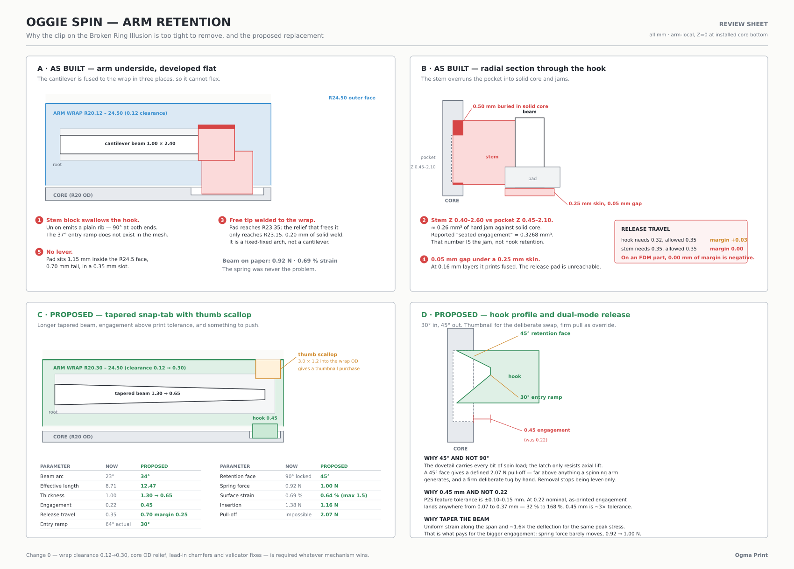

# Oggie Spin — arm retention review

Status: **BUILT.** Change 0 and Option A are implemented in
`oggie_spin_complete.py` and the active Broken Ring Illusion 3MF has been
regenerated against them. See *What was actually built* below for where the
as-built geometry departs from this review.

---

## What was actually built

Final numbers, computed from the as-built constants:

| | Old | Built |
| ------------------- | -------------- | -------------------- |
| Tongue | 3 rails (dovetail + 2 guides) | **1 solid dovetail, 0.18/side** |
| Beam | 1.00 × 2.40, 23° | 1.05 → 0.525 × 5.50, 34° |
| Effective length | 8.71 mm | 11.83 mm |
| Engagement | 0.22 mm | **0.45 mm** |
| Release travel | 0.35 mm | **0.70 mm** (0.25 margin) |
| Entry ramp | 64° realised | **30°** |
| Retention face | 90°, locked | **45°** |
| Spring force | 0.92 N | 0.685 N |
| Loaded insertion travel | 11.7 mm | **1.9 mm** (core entry channel) |
| Surface strain | 0.69 % | **0.66 %** (15.6 MPa, 3.4:1 on flexural strength) |
| Insertion | 1.38 N | 0.80 N |
| Pull-off | impossible | **1.42 N** (1.27–1.57) |
| Seated interference | 0.327 mm³ (a jam) | **0.000 mm³** |
| Axial play | 0.20 mm free lift | **0.08 mm** |
| Wrap clearance | 0.12 mm | 0.30 mm + chamfers both sides |

Five departures from the plan above — some forced by geometry the review did
not account for, one at Conall's direction after the first build:

1. **No thumb scallop.** The review proposed cutting a finger scoop into the
   wrap OD. Unnecessary once the barb was moved to the core's exposed far face,
   where it is visible and can simply be pressed. This keeps the colour band
   unbroken and the 49 mm tip envelope unchanged, which is strictly better.
   (The original justification given here — that a fingernail enters from below
   and braces on the outer wall — was wrong; see the correction below.)
2. **The beam is thinner and deeper than planned** — 1.05 → 0.525 × 4.50 mm
   rather than 1.30 → 0.65 × 2.60. The tab has to sit outboard of the tongue,
   which leaves roughly 3.3 mm of radial budget to split between an inner gap,
   the beam, the deflection space and the outer wall. Depth in Z buys back the
   spring rate without touching strain, so the beam got deeper instead of
   thicker.
3. **The three-rail tongue is gone — replaced by one solid dovetail** at
   Conall's direction, on the strength of earlier physical testing. Three rails
   meant three independent tolerance stacks, three thin features that can shave,
   and gaps that let the arm rock before any one rail took load. Uniform
   0.18 mm/side, splitting the old 0.16 (central) / 0.22 (guides).

   While making that change: `SLIDE_OUTER_R` is clamped by
   `ARM_SLOT_OUTER_R - 0.05 = 20.75`, so it never reached 21.40 in the built
   geometry — an earlier trim to 21.15 "to clear the tab void" was based on
   misreading the reported constant for the real profile. Restored to 21.40
   (nominal) and the freed 0.25 mm went into the outer wall: the colour band is
   now **1.05 mm** rather than 0.80.
4. **The pocket is sized to the engaged Z window, not the hook's height.** A
   45° retention face sweeps the hook's inner radius from 19.55 back out to
   20.30, so its top 0.30 mm sits in the wrap clearance gap and engages
   nothing. Sizing the pocket to the hook's overall height let the arm lift
   0.38 mm before touching anything.
5. **Pocket clearance is asymmetric** — 0.30 mm below, 0.08 mm above. A
   symmetric 0.25 mm left a quarter-millimetre of free lift, which is rattle.

### Correction, after measuring the shipped mesh

Everything below this heading was written before the final geometry was measured
on the exported STL. Three claims in it are wrong, and they are left in place
because the way they went wrong is the useful part.

**The beam is 0.80 → 0.40 mm × 3.45 mm deep, 7.70 mm free.** Not the
1.05 × 4.50 mm below, and not the 0.95 × 2.05 mm that reached `active/README.md`.
Those three descriptions span two revisions and one transcription error. The
error survived review because `b·t³` happens to come out almost identical for
0.95 × 2.05 and 0.80 × 3.45 — the force looked right, so nobody checked the
dimensions.

**Pull-off is 1.42 N, not 2.20 N.** The 2.20 N figure came from feeding the
barb's *total protrusion from the beam face* (0.65 mm, measured) into the
deflection term. The deflection the core actually demands is 0.45 mm: the barb
crest sits at x 13.350 and the retaining lip face at x 13.800. Forces now come
from `clip_forces()` in the generator and are written into the validation JSON,
so prose can no longer disagree with geometry.

**The print flip is gone, and its stated benefit was backwards.** Below it is
credited with putting the beam in in-plane bending and buying ~3× ductility. The
beam is in in-plane bending *because the arm prints top-face-up*, which is the
unflipped orientation. The flip did the opposite — it lifted the beam's first
layer 10.35 mm into the air, and that is the floating cantilever Bambu Studio
flagged. Worse, it was implemented as a −1 axis scale, a reflection rather than
a rotation, so the exported clip landed on the mirror-image side while every
self-referential interference check still passed.

**Is 1.42 N enough?** Unknown, and deliberately so — this redesign started
because the old clips were too tight. 1.42 N is about 145 gf. The sanity plate
answers it. If it is too light, `CLIP_ROOT_THICK` 0.80 → 0.90 gives 2.03 N
(force goes as t³) without touching the 0.25 mm release margin, and leaves the
stress margin at 3.0:1. Raising `CLIP_ENGAGEMENT` instead would collapse the
release margin to 0.10 mm and is the wrong knob.

### A correction on materials, and one on ergonomics

Two things in the first draft of this build were wrong and are worth recording.

**The modulus was 19 % too high.** I sized the beam at an assumed 2900 MPa. The
published Bambu PLA Matte data sheet gives X-Y flexural modulus **2360 ± 250 MPa**,
which put the real pull-off at 1.80 N rather than the 2.20 N quoted. Fixed by
taking the beam from 4.50 to 5.50 mm deep — depth raises spring force linearly
with no strain penalty at all, so it is the free lever.

The same data sheet corrected an assumption in the opposite direction, and more
usefully: Matte PLA's X-Y elongation at break is **14.8 ± 4.2 %**, not the ~3.5 %
I had assumed from its reputation for brittleness. The beam runs at 0.57 % —
under 4 % of that, and 25 % of the 53 MPa flexural strength. There is far more
headroom than the original review credited.

Worth noting why that headroom exists: in Z the same material gives 4.8 %
elongation and 29 MPa. The flipped print orientation, which puts the beam in
in-plane bending, is worth roughly **3× the ductility** on the one part that
flexes. That was chosen for overhang reasons; it turns out to matter far more
than that.

**The fingernail release does not work.** I claimed a nail could enter the void
and lever the tab out. It cannot: the gap beside the beam is 0.35 mm, a
fingernail is about 0.5 mm, and widening it would leave a 0.2 mm wall. The
straight pull is the release, together with pressing the barb where it is
visible on the far face. Neither is a fingernail lever, and that should be
stated plainly rather than dressed up with a path that does not exist.

### The entry channel

Simulating insertion showed the hook riding the core OD under full spring load
for **11.7 mm on every insertion** — the actual wear surface for the 100-cycle
gate, and most of the insertion effort. A 0.65 mm channel in the core OD, from
the top face down to a 0.90 mm retaining lip above the pocket, drops that to
**1.9 mm**. The hook falls through undeflected and only cams over the lip. The
channels are hidden under the arms and clear the slot edge by 1.2°.

Verified by stepping the arm down through the core in 3D and binary-searching
the deflection demanded at each height: peak demand 0.46 mm against 0.90 mm of
travel space, and it seats at exactly 0.00.

And one bug found in this work, worth recording because it is the same class of
defect as the original: **my first cut of the void cleared only the beam's
outer face.** The inner face stayed flush against wrap solid for the beam's
whole length — welded, and invisible to every volume-based check, because a
weld adds no interference. The validator now walks the beam span and asserts
open air on *both* faces.

A note on the hard stop: the tab bottoms out on the void's outer wall at
0.90 mm of deflection, which is 0.72 % strain — still less than half the PLA
ceiling. Over-flexing the tab by hand cannot break it.

---

Applies to: **the active design**, `active/Oggie_Spin_Broken_Ring_Illusion_P2S.3mf`.
`oggie_spin_broken_rings.py` calls `complete.build_arm()` directly, so the arm
geometry analysed below is the arm that ships in the Broken Ring Illusion — not
an archived variant.

Reported symptom: *the current clips are too tight and hard to remove.*



Regenerate the sheet:

```bash
python3 scripts/generate_spinner_retention_sheet.py
```

## This is the third latch generation to fail on removal

From `PROJECT_STATUS.md`:

> "Solid-slide with shallow friction ribs inserted by hand but **was hard to
> remove**; a later rigid 0.13 mm side-detent trial **required tools and
> trapped the arms**."

Three mechanisms, three different working principles, same failure. That is a
pattern, not bad luck: **every generation has specified how the arm goes in and
none has specified how it comes out.** Entry ramps, lead-ins and insertion
clearances are dimensioned throughout the codebase; there is no release-force
target, no release-travel margin floor, and no accessible release feature in
any revision.

Whatever mechanism wins, it needs a *designed* release path with its own
numbers — that is the through-line of the recommendation below.

## Headline

The three-rail + underside cantilever clip is a **sound mechanism that is
welded shut by five modelling defects**. On paper the beam is soft — 0.92 N to
deflect, 0.69% surface strain, well inside Matte PLA's limits. As built, the
cantilever is fused to the wrap at its tip, capped by an unprintable skin, and
its hook is swallowed by a solid stem block that jams into un-pocketed core.

**The arm is not currently retained by a snap hook. It is retained by a block
of plastic wedged into solid core material, and released by brute force.** That
is exactly what "too tight and hard to remove" feels like.

This matters for the decision: switching to a different mechanism *without*
fixing the defects will reproduce them, and fixing the defects may be most of
the fix on its own. So the recommendation below is a fix **plus** a mechanism
change, not a replacement.

---

## Part 1 — What is actually wrong

All values arm-local, Z = 0 at the installed core bottom. Source is
`backend/generator/oggie_spin_complete.py`.

| Feature | R (mm) | Z (mm) | Arc (deg) |
| ------------- | -------------- | ----------- | ------------ |
| beam | 21.80 – 22.80 | 0.30 – 2.70 | −11.0 – 12.0 |
| hook lip | 19.68 – 20.22 | 1.45 – 1.90 | 8.5 – 15.5 |
| stem | 19.65 – 21.95 | 0.40 – 2.60 | 8.5 – 15.5 |
| release pad | 21.45 – 23.35 | 0.30 – 1.00 | 8.0 – 13.0 |
| relief cut | 21.45 – 23.15 | 0.25 – 3.20 | −11.0 – 12.8 |
| core pocket | 19.60 – 20.00 | 0.45 – 2.10 | — |

### Defect 1 — the hook is swallowed by the stem

The `stem` block (R 19.65–21.95, Z 0.40–2.60) **fully contains** the hook lip
and its entry ramp. The union at `_underside_clip()` therefore emits a plain
rectangular rib that is **90° at both ends**.

`CLIP_ENTRY_ANGLE_DEG = 37.0` is reported in the validation JSON but does not
exist in the mesh. There is no lead-in on insertion and no cam-out on removal.

(Independently, the ramp loft is mis-sized anyway: `ramp_inset` is computed from
a 1.35 mm rise but applied over 0.90 mm, and the result is clamped by the `max()`
on the lower profile. Had the stem not swallowed it, the realised ramp would
have been ~64°, not 37°.)

### Defect 2 — the stem does not fit the pocket, so it jams

Core pocket spans Z 0.45–2.10. The stem spans Z 0.40–2.60. It overruns the
pocket by **0.50 mm at the top and 0.05 mm at the bottom**, at R 19.65–20.00 —
i.e. buried inside solid core, over 7° of arc. That is ≈ 0.26 mm³ of hard
interference.

The reported `installed_intersection_volume_mm3` is **0.3268**, sitting inside
the accepted `CLIP_HOOK_INTERFERENCE_MIN/MAX` window of 0.01–2.50. The
validator's `hook_relief` mask (R 19.45–20.47, Z 0.15–3.30) covers exactly the
overrun band, so it reports `unexpected_intersection = 0.0`.

**The "seated engagement" the test measures is the jam, not hook retention.**
The check cannot fail.

### Defect 3 — the cantilever tip is welded to the wrap

The release pad reaches R 23.35 and 13.0°. The relief cut that is supposed to
free it only reaches R 23.15 and 12.8°. The pad is therefore unioned into
**un-relieved wrap solid** — 0.20 mm radially and 0.2° angularly.

`build_arm()` relieves the wrap *before* unioning the clip, so nothing removes
this afterwards. The free end of the cantilever is bonded to the part it is
supposed to spring away from. **It is a fixed-fixed arch, not a cantilever.**

### Defect 4 — an unprintable skin caps the whole clip

The relief cut starts at Z 0.25; the wrap starts at Z 0.00. A **0.25 mm solid
skin** covers the entire clip cavity, separated from the pad's face by a
nominal **0.05 mm** air gap.

At 0.16 mm layers a 0.05 mm gap cannot be resolved. The clip prints fused to
that skin across its whole footprint, and the "fingertip pressure" pad is not
reachable at all.

### Defect 5 — there is no lever, and zero release margin

- The pad's outer edge sits **1.15 mm inside** the arm's outer face (R 24.5).
  It is a recessed ledge 0.70 mm tall in a 0.35 mm slot. There is nothing to
  push.
- Release travel is allowed at 0.35 mm. The hook needs 0.32 mm to clear the
  core OD (**+0.03 mm margin**). The stem needs **0.35 mm — margin exactly
  0.00 mm.** On an FDM part, that is negative.

### Contributing — the insertion interference stack

Four independent tight fits engage on a single 14 mm push:

| Surface | Clearance | Note |
| ---------------------- | ----------- | ------------------------------------ |
| wrap inner vs core OD | 0.12 mm | 14 mm tall, 40° of arc, curved |
| central dovetail | 0.16 mm/side | the load path — correctly snug |
| guide rails ×2 | 0.22 mm/side | already loose |
| hook / stem | 0.22 mm | see above |

The 0.12 mm wrap clearance sits **inside** realistic P2S surface deviation
(±0.10–0.15 mm) and the core prints flat-face-down with `no_brim` and a 0.20 mm
initial layer — so elephant's foot swells the first ~0.4 mm of the OD by
0.10–0.30 mm. That is precisely the zone the wrap must slide past first, and
there is **no chamfer on the wrap's inner leading edge** and **no relief on the
core OD near Z = 0**. `ARM_TONGUE_LEAD_IN = 0.40` is applied to the rails and
the slot mouth only.

The clip pocket itself lives at Z 0.45–2.10 — layers 3–13 on the core's bed
side, in the same elephant's-foot zone, with only 0.08 mm of radial pocket
clearance to absorb it.

---

## Part 2 — Change 0: required whatever mechanism wins

These are independent of the latch choice and should land first.

| Change | From | To | Why |
| ------------------------------- | ---- | ---- | ------------------------------------------------------- |
| Wrap inner clearance | 0.12 | 0.30 | 0.12 is inside FDM noise; the dovetail locates the arm, not the wrap |
| Core OD relief, bottom 0.6 mm | — | 0.35 | wrap never touches the squished first layers |
| Wrap inner leading-edge chamfer | — | 0.60 × 45° | arm self-aligns instead of jamming square-on-square |
| Core top OD edge chamfer | — | 0.40 × 45° | entry lead-in for the wrap |
| Clip pocket radial clearance | 0.08 | 0.20 | absorb elephant's foot in the pocket too |
| Central dovetail clearance | 0.16 | 0.16 | **unchanged** — this is the load path |
| Guide rail clearance | 0.22 | 0.22 | **unchanged** — already loose |

Note on the 0.30 mm wrap gap: the source comment records that *"0.25 mm wrap
gap rattled"*. That rattle was the wrap being asked to do location work. Once
the latch actually holds axially and the dovetail holds radially, the wrap
should be a clearance surface, not a fit surface. If 0.30 mm looks visually
loose at the colour seam, close it with a **cosmetic lip in the top 2 mm only**
rather than down the full 14 mm.

Validator changes required regardless:

- Delete the `hook_relief` mask, or narrow it to the pocket volume exactly, so
  a stem/pocket overrun can fail.
- Assert `unexpected_intersection == 0.0` against the **true** core solid.
- Add an explicit `release_travel_margin_mm` check with a floor of 0.20 mm.
- Add a "cantilever is topologically free" check: the latch body must touch the
  wrap **only** across its root face.

---

## Part 3 — Mechanism options, rated

Scored 1–5, higher is better. Constraints applied: five geometrically identical
arms, volume/mass neutral, Matte PLA, supports off, arm prints flush-top-face
down, R188 remains the only non-printed part, 9 / 2 plate counts, and the
optically committed surfaces (core top, core underside identifier, arm top) are
off limits. Retired mechanisms — friction ribs, rigid side detents, Pinch-Lok
flex rails/barbs, legacy barb recesses, solid-slide, long petals — are not
revisited.

| # | Mechanism | Removal | Insert | Retention | Fatigue | Tolerance | Mass/ID | Repo fit | Effort | **Total** |
| - | ------------------------------- | ------: | -----: | --------: | ------: | --------: | ------: | -------: | -----: | --------: |
| **A** | **Tapered snap-tab + thumb scallop** | **5** | **5** | **4** | **5** | **5** | **5** | **5** | **4** | **38** |
| 0 | Fix the build, keep the geometry | 4 | 4 | 3 | 5 | 3 | 5 | 5 | 5 | 34 |
| B | Core-side flexure, passive arm | 4 | 4 | 4 | 3 | 4 | 5 | 3 | 2 | 29 |
| C | Underside retaining collar | 2 | 5 | 5 | 5 | 5 | 5 | 2 | 3 | 32 |
| D | Twin flank tabs | 3 | 4 | 5 | 4 | 4 | 5 | 2 | 3 | 30 |
| F | TPU band | 5 | 5 | 4 | 5 | 5 | 4 | 1 | 4 | 33 |
| E | Drop-and-twist quarter turn | 3 | 3 | 2 | 5 | 4 | 5 | 2 | 1 | 25 |
| G | Split-tongue arrowhead barbs | — | — | — | — | — | — | — | — | **rejected by policy** |

### A · Tapered circumferential snap-tab with thumb scallop — recommended

Your suggestion, sized properly. Keeps the latch on the arm underside (the one
surface with no optical commitment), keeps in-plane bending — correct for a part
printed flush-top-down — and changes nothing about plates, colours, mass or the
optical variants' phase.

| Parameter | Current | Proposed |
| ------------------------- | ------- | ---------------- |
| Beam arc | 23° | 34° (−17° to +17°) |
| Effective beam length | 8.71 mm | 12.47 mm |
| Beam thickness | 1.00 mm | 1.30 → 0.65 mm tapered |
| Beam height (Z) | 2.40 mm | 2.60 mm |
| Hook engagement | 0.22 mm | **0.45 mm** |
| Release travel | 0.35 mm | **0.70 mm** (0.25 mm margin) |
| Entry ramp | 64° (realised) | **30°** |
| Retention face | 90° — locked | **45°** |
| Spring force | 0.92 N | 1.00 N |
| Surface strain | 0.69% | **0.64%** (ceiling 1.5%) |
| Insertion force | 1.38 N | **1.16 N** |
| Pull-off override | impossible | **2.07 N** |

Four things do the work:

1. **Taper the beam** 1.30 → 0.65 mm and lengthen the arc to 34°. Uniform
   strain along the span, and double the deflection for the same stress. This
   is what buys the engagement increase for free.
2. **Engagement 0.22 → 0.45 mm.** 0.22 mm is smaller than the print's own
   feature tolerance — as-printed engagement could land anywhere from 0.07 to
   0.37 mm. 0.45 mm is ~3× tolerance, so it is a real number.
3. **Retention face 90° → 45°.** A 45° face gives a *defined* pull-off at
   2.07 N. The dovetail carries all spin load; the latch only resists axial
   lift, and 2.07 N is far above anything a spinning arm generates while still
   being a firm deliberate tug. This alone converts "hard to remove" into
   "removable two ways".
4. **A real lever.** Rather than protruding past R 24.5 and growing the
   envelope, scallop a 3 mm × 1.2 mm finger scoop *into* the wrap OD behind the
   tab tip, so the tip stays at R 24.5 and there is a thumbnail purchase behind
   it. Reads as a deliberate detail — the same visual language as a camera
   battery door — on the one uncommitted visual surface.

Dual-mode release is the point: thumbnail on the scoop for the intentional
swap, firm straight pull as the override. Neither requires a tool, and neither
depends on 0.03 mm of margin.

Risk: the scallop is on the outer wrap, which is currently a clean colour band.
Worth an SVG before committing.

### 0 · Fix the build, keep the geometry as designed

The honest floor. Unweld the tip, drop the skin, shrink the stem into the
pocket, restore the ramp. Cheapest change and it probably fixes the symptom.

Not recommended **alone**, because it leaves 0.22 mm engagement (below print
tolerance), 0.03 mm release margin and a 90° retention face — so removal stays
lever-only with no override, and unit-to-unit consistency stays poor. Every
part of Change 0 and option A subsumes this work anyway.

### B · Core-side flexure, arm becomes a passive block

Put the five cantilevers in the core and give the arm a plain 0.45 mm undercut
groove. Genuinely attractive: arms become simple solid blocks, which is ideal
for mass matching, for the optical inlays, and for cheap five-colour reprints.

Against it: 1.32% strain in a short beam (near the ceiling), the flexure lives
on the **non-replaceable** part and cycles on every swap at that station, and
the core OD only has 32° between adjacent slots to host it while already
carrying the bearing pocket and slot walls. Also the highest risk to the VX
variant's core phase.

Right idea, wrong revision. Revisit for V2 if arm mass spread becomes the
binding constraint.

### C · Underside retaining collar

A 1.0 mm printed ring on the core underside overlapping all five tongues. Arms
need **no** retention feature at all. Mechanically the best answer by a
distance — no flexure, no fatigue, no tolerance sensitivity, and it makes arms
flying off at speed physically impossible.

It fails on the product promise. Swapping one arm means removing the collar,
so "arms swap like bricks" becomes "disassemble the spinner". Also adds a 10th
plate and a second loose part, and must go on the **underside** because the
core top face is optically committed — which puts it against the 1.6 mm
hub-to-core gap (1.0 mm collar leaves 0.60 mm).

Worth keeping in the back pocket as a **safety collar for a high-speed or
kids' SKU**, where non-removability is a feature.

### D · Twin flank tabs

One tab per ±20° wrap edge. Strong and self-centring, but you must press two
tabs simultaneously to release — worse ergonomics than the single lever, which
is the actual complaint. The flanks are also the visible colour-to-colour seam.

### F · TPU band

A 1.5 mm TPU cord in a groove across all five wraps. Mechanically lovely:
effectively infinite fatigue life, absorbs ±0.30 mm of print variation, trivial
removal. But it breaks *"the R188 is the only non-printed part"*, adds a loose
consumable, and needs a second material.

Not for V1 — but a strong candidate for a **"sport band" accessory SKU** later,
where a coloured band over the seam is a styling feature that happens to add
retention.

### E · Drop-and-twist quarter turn

Zero flexure, retention in pure shear. Two problems, one fatal:

- The tongue is a radial dovetail. It cannot rotate in its slot, so this needs
  a full T-slot tongue redesign.
- **A spinner is spun in both directions.** Inertia on spin-up will drive the
  arms toward unlock on one of the two directions, every time. There is no
  orientation that avoids this.

### G · Split-tongue arrowhead barbs — rejected by policy

Barbed prongs on the central dovetail. This is *Pinch-Lok flex rails/barbs*,
explicitly retired in `AGENTS.md`: *"Do not restore friction ribs, rigid side
detents, Pinch-Lok flex rails/barbs, or legacy barb recesses."* It also
recombines the two jobs the current revision deliberately separated — rails
carry radial and torsional load, the latch carries axial only.

---

## Recommendation

**Change 0 + Option A**, in one matched core/arm revision.

Order of work:

1. Land Change 0 and the validator fixes. Regenerate and confirm the release
   margin and free-cantilever checks now *can* fail.
2. Implement Option A's tab geometry.
3. Emit a **fit-test coupon plate** before the full nine-plate rebuild: one
   72° core sector plus three arms at engagement 0.35 / 0.45 / 0.55 mm, so the
   engagement number is settled physically rather than by calculation.
4. Rebuild the complete package and the eight optical variants against the new
   matched revision.

Physical gates to carry forward, unchanged in spirit: 100 insert/release cycles
with no whitening or cracking, no accidental release in normal handling, no
tool required either way, and ≤0.2 g mass spread across the five arms.

## Stale docs noticed

`design/modular-spinner/README.md` still lists coupons **5. "Solid-slide fit"**
and **6. "Friction-rib life"** under "First coupons to print" — both mechanisms
are retired at line 83 of the same file. Worth clearing when this revision
lands.
