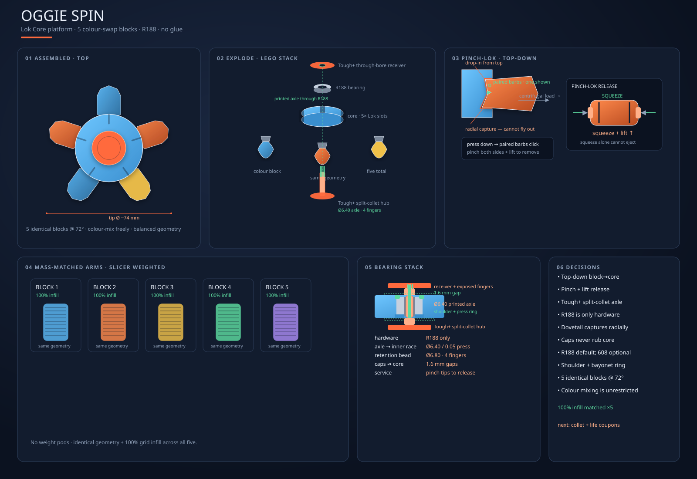

# Oggie Spin — modular fidget spinner

A pick-and-mix fidget spinner built on the **Lok Core** joint platform: one
round core, five colour blocks and two thumb caps. No glue or metal fastener.
Arms swap like bricks; the R188 is the only non-printed part.

**Active design: Broken Ring Illusion.** Everything else in this tree is
archived. See [`active/`](./active/) for the current package and
[`archive/`](./archive/) for what was tried and why it was retired.

Status: **printable prototype generated; physical approval pending.** The arm
retention mechanism is under review — see
[`ARM-RETENTION-REVIEW.md`](./ARM-RETENTION-REVIEW.md).



## Layout

```text
design/modular-spinner/
├── ARM-RETENTION-REVIEW.md        arm latch diagnosis + rated options
├── active/                        Broken Ring Illusion — the only live design
│   ├── Oggie_Spin_Broken_Ring_Illusion_P2S.3mf
│   ├── broken-ring-meshes/        17 printable meshes
│   ├── broken_ring_variant_validation.json
│   ├── oggie-spin-concept.svg     current blueprint
│   └── oggie-spin-thumb-mechanisms.svg
└── archive/                       superseded — do not build from these
    ├── clip-lock-complete/        plain five-colour package (no optics)
    ├── broken-ring-batch/         one-plate five-arm batch + stale inlay mesh
    ├── bayonet-fit-test/          superseded M3 cap/bearing mechanism
    ├── optical-variants/          seven losing optical experiments + shutter
    ├── visuals/                   early three-arm renders
    └── lok-core-concept.svg       earliest joint concept
```

## Regenerate

The active package:

```bash
.venv/bin/python backend/generator/oggie_spin_broken_rings.py \
  --out design/modular-spinner/active
```

> **Note:** this generator also emits `Oggie_Spin_5x_Broken_Ring_P2S.3mf` into
> the output directory. That batch plate is archived, so delete it from
> `active/` after a rebuild, or add a `--no-batch` flag to the generator.

Concept sheets:

```bash
python3 scripts/generate_spinner_concept_svg.py
python3 scripts/generate_spinner_thumb_options_svg.py
```

Archived packages (only if you need to reproduce a retired build):

```bash
.venv/bin/python backend/generator/oggie_spin_complete.py \
  --out design/modular-spinner/archive/clip-lock-complete
.venv/bin/python backend/generator/oggie_spin_bayonet.py \
  --out design/modular-spinner/archive/bayonet-fit-test
.venv/bin/python backend/generator/oggie_spin_optical_variants.py \
  --out design/modular-spinner/archive
.venv/bin/python backend/generator/oggie_spin_shutter_infill.py \
  --out design/modular-spinner/archive
```

### Generator dependency map

Archiving the *outputs* did not archive the *code* — the active build still
imports three of the other modules:

```text
oggie_spin_broken_rings.py          ACTIVE — owns the Broken Ring Illusion
  ├── oggie_spin_complete.py        LIVE DEPENDENCY — build_arm(), core,
  │     └── oggie_spin_bayonet.py   LIVE DEPENDENCY — base primitives, 3MF machinery
  └── oggie_spin_optical_variants.py  LIVE DEPENDENCY — _identifier_volume() only
oggie_spin_shutter_infill.py        standalone; nothing imports it
```

Do not delete or move any of these modules. `oggie_spin_optical_variants.py` is
imported for a **single helper**; inlining `_identifier_volume()` into
`oggie_spin_broken_rings.py` would make the active build depend on two modules
instead of three.

## The active design

The Broken Ring Illusion is the optical winner on the matched clip-lock
mechanism. Two 1.1 mm broken tracks on the core (15 and 20 dashes) and one on
the five arms (25 dashes) use flush 0.32 mm-deep Ivory White Matte inlays, plus
an underside `BR` identifier. Optical inlays load in slot 7.

Keep the 15/20/25 ring pattern unchanged; do not add a fourth ring.

Nine plates, 17 objects, seven filament slots:

1. Broken-ring core with five dovetail slots, clip pockets and R188 seat
2. Press-fit outer-race retaining ring
3. Tough+ split-collet through-axle hub and through-bore receiver hub
4. Two identical 6.4 mm socketed thumb pads
5–9. Five wrap-around clip-lock colour segments with arm-ring inlays

The shared mechanical dimensions — tolerances, bearing seat, cartridge, thumb
bayonet — are recorded in
[`archive/clip-lock-complete/dimensions_and_validation.json`](./archive/clip-lock-complete/dimensions_and_validation.json).
That file is archived because its *3MF* is archived, but it remains the
dimensional reference for the mechanism the active design shares.

## What we kept from the brief

- Larger round **direct-drive core** with five vertical side slots at 72°
- **R188** bearing at the centre
- Two textured Ø20 thumb caps on a fully printed **Tough+ split-collet
  through-axle and receiver**
- Five geometrically identical **wrap-around colour segments**
- **100% infill** supplies segment mass without separate weight pods
- Colour choice does not alter balance; geometry and slicer settings must match
  across all five segments

## Arm joint — under review

The current arm uses a **three-rail loose slide** with an **underside
cantilever clip**:

- Assemble by dropping the block down from the top of the core
- Central dovetail (~0.16 mm/side) plus two tapered guide rails (~0.22 mm/side)
  carry radial and torsional load
- A 2 mm bottom shelf seats the arm in Z
- An integrated Matte PLA underside clip snaps into a core OD pocket

⚠️ **This mechanism is too tight to insert and too hard to remove.** The cause
is five modelling defects that weld the cantilever to the wrap, not the
mechanism concept. Do not build a new revision from these tolerances until the
review lands — see [`ARM-RETENTION-REVIEW.md`](./ARM-RETENTION-REVIEW.md).

Friction ribs, rigid side detents, Pinch-Lok flex rails/barbs and legacy barb
recesses are retired. Do not restore them. Do not restore the earlier long
petal arms — physical testing showed easy lift/rattle and uneven one-side lock.
New cores and arms are a matched pair; do not claim old-arm or old-core
compatibility.

## Cap / bearing stack — printed Tough+ split collet

No M3 screw and no nyloc. The structural cartridge is two vertical-printing
Tough+ parts:

- **Split-collet hub:** Ø6.40 through-axle, four 8.1 mm fingers, Ø6.80 bead
- **Receiver hub:** Ø6.48 through bore; the bead emerges beyond the outer face
- **Integrated spacers:** Ø8.40 bosses bearing only on the R188 inner race
- **Hub clearance:** 1.6 mm air gap to each core face
- **Outer-race retention:** Ø15.22 pressed ring in a Ø15.15 counterbore

The printed clamp path must touch only the inner race. The shoulder and bearing
ring must touch only the outer race; neither may contact the shields.

Do not hammer or use pliers to force the axle through the bearing. Tough+
creep, finger whitening and 100 release cycles remain physical gates.

## Resolved concept dimensions (targets)

All mm. Final numbers lock when coupons print.

| Item                       |                  Target |
| -------------------------- | ----------------------: |
| Core outer Ø               |                      40 |
| Core height                |                      14 |
| Bearing seat Ø (R188)      |   12.82 hand-fit target |
| Slot count                 |                 5 @ 72° |
| Dovetail axial depth (Z)   |                      12 |
| Dovetail radial engagement |                     4.5 |
| Segment tip radius         |        24.5 from centre |
| Assembled height (caps)    |                  ~23–24 |
| Cap flange Ø               |                      20 |
| Printed axle OD            | 6.40 interference trial |
| Receiver bore              |                    6.48 |
| Collet bead OD             |                    6.80 |
| Non-printed hardware       |               R188 only |

## Print orientation

| Part         | Bed face           | Why                                                |
| ------------ | ------------------ | -------------------------------------------------- |
| Core         | flat face          | round accurate, slots print as vertical walls      |
| Arms         | flush top face     | avoid tongue overhang above the 2 mm bottom shelf  |
| Collet hub   | flange down        | axle and four fingers build vertically             |
| Receiver hub | flange down        | through bore and integrated spacer stay concentric |
| Thumb pads   | finished face down | bayonet cavities face upward                       |
| Bearing ring | flat               | outer-race retainer                                |

## Physical gates — all still open

1. **Cartridge** — confirm the Ø12.82 bearing pocket accepts the R188 by hand
   and the outer-race ring captures it; verify collet snap, release access,
   1.6 mm hub gaps and both pad locks
2. **Collet life** — 100 assemble/release cycles with no whitening, cracking,
   fused fingers, bead damage or increase in axial play
3. **Thumb-bayonet life** — 100 lock/unlock cycles with no cracked lugs,
   chipped tracks or meaningful increase in play
4. **Outer-race retainer** — the Ø15.22 ring in the Ø15.15 counterbore cannot
   lift by hand and contacts only the outer race
5. **Arm latch** — blocked pending the retention review
6. **Balance set** — weigh all five blocks; ≤0.2 g spread target

Do not use drill-driven or high-speed testing until these gates pass.
