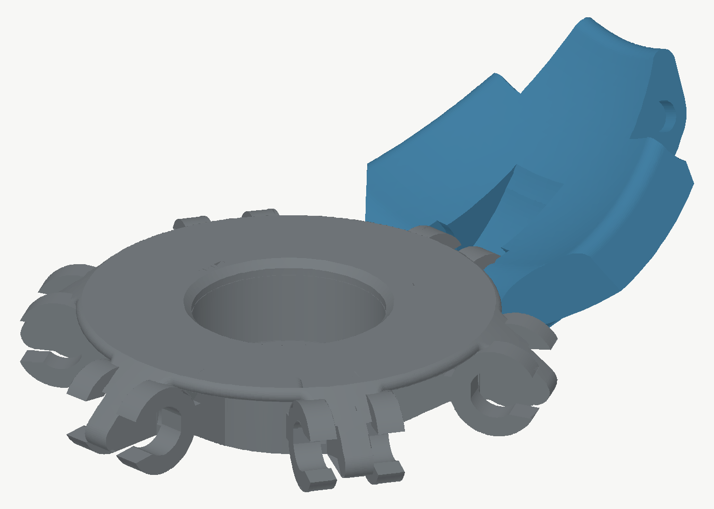

# Squspi ball reconstruction

The supplied Squspi files are tessellated STL/3MF exports. They do not contain
editable STEP, Fusion, or SolidWorks bodies, so the design is being rebuilt from
four measured master meshes:

- 1 link, printed 6 times
- 1 mushroom button, printed twice
- 1 six-arm base, printed twice
- 1 curved panel, printed 13 times

Two R188 bearings complete the rotating centre. Nominal R188 dimensions are
6.35 mm bore, 12.70 mm outside diameter, and 4.7625 mm width.

## Bearing decision

Keep the R188 architecture. The current prototype already spins well, the
12.70 mm OD fits the existing base without consuming the arm structure, and
the bearing's load/speed capacity is far beyond this hand-operated toy.

Procure by dimensions, not by the `R188` name alone: suppliers use that label
for more than one width. The target is:

```text
R188
6.35 mm bore × 12.70 mm OD × 4.7625 mm width
normal internal clearance
```

`ZZ` is only a shield suffix commonly added when an R188 has two metal shields;
it is not a different bearing size or a design change. Metal shields remain the
preferred production compromise: lower drag than rubber-sealed `2RS`, but
better contamination protection than an open bearing. Keep the current working
bearing variant as the control during testing. A 608 bearing is unnecessarily
large at 8 × 22 × 7 mm and would materially weaken or enlarge the existing hub.
A metric MR126 (6 × 12 × 4 mm) is a viable supply-chain fallback, not a
performance upgrade; it would require new shafts, seats, and stack dimensions.

## Reconstruction sequence

1. Measure the current prototype: repeatable spin coast time, axial play,
   visible runout, mass, opening/closing force, and a reference video.
2. Keep the dimension-specified R188 and print an assembled bearing-stack
   coupon with race-specific shoulders and 0.10/0.20/0.30 mm axial freedom.
3. Print source-like pin/socket variants and a one-sector mechanism containing
   one base arm, one link, and one curved panel in their real orientations.
4. Freeze bearing stack, pin/socket geometry, pivot centres, and the full
   collision envelope before refining cosmetic surfaces.
5. Complete and verify the parameter-driven baseline against critical
   dimensions. Global mesh-distance scores remain diagnostic only.
6. Print one full baseline ball and compare it with the current prototype.
7. Test V2 changes separately: panel gap shields/edge radii, reinforced links,
   then support-light print features.
8. Package only accepted combined changes in a genuine Bambu Lab P2S 3MF.

Do not change the spin mechanism while reconstructing the baseline. The current
prototype reportedly spins well, so geometry changes must be isolated and
measured rather than bundled together.

## Generate stage-one outputs

```bash
.venv/bin/python backend/generator/squspi_ball_reconstruction.py \
  --source-dir "/path/to/Squspi+ball_stls" \
  --out /tmp/squspi-reconstruction
```

Outputs:

```text
reference_masters/
  base_reference.stl
  button_reference.stl
  link_reference.stl
  panel_reference.stl
parametric_candidates/
  button_baseline.stl
  base_baseline.stl
  link_baseline.stl
  panel_shell_core.stl
  panel_baseline.stl
coupons/
  r188_fit_matrix.stl
  r188_stack_0_{10,20,30}_{base,cap}.stl
  snap_pin_head_2_{35,45,55}.stl
  panel_socket_2_{15,20,25}.stl
  link_root_matrix.stl
  running_clearance_0_40_{female,male}.stl
  running_clearance_0_50_{female,male}.stl
  running_clearance_0_60_{female,male}.stl
reconstruction_report.json
```

The R188 matrix tests 12.55/12.65/12.75 mm housings and
6.20/6.30/6.40 mm shafts. Select fits by physical print rather than nominal CAD
alone. Add exact source-adjacent values to the assembled stack coupon rather
than expanding this basic printer gauge. The clearance pairs test
0.40/0.50/0.60 mm per-side movement, but are calibration aids only: they do not
freeze the spherical mechanism's running clearance.

### Physical R188 coupon result — P2S / Matte PLA

The rightmost / three-dot option worked for both interfaces:

```text
Selected housing ID: 12.75 mm
Selected shaft OD:    6.40 mm
```

The two smaller housing options and two smaller shaft options were unusable.
Treat 12.75/6.40 as the provisional printer-calibrated fit. It becomes final
only after the assembled stack confirms free spin without race clamping,
housing creep, or excessive removal force.

Printable Bambu Lab P2S projects are written to `p2s_projects/`:

```text
Squspi_R188_Fit_Coupon_P2S.3mf
Squspi_R188_Assembled_Stack_Coupon_P2S.3mf
Squspi_Pin_Socket_Fit_Matrix_P2S.3mf
Squspi_Compliant_Socket_Coupon_P2S.3mf
Squspi_Source_Joint_Control_P2S.3mf
Squspi_Hybrid_Reconstructed_Link_Sector_P2S.3mf
Squspi_Hybrid_Reconstructed_Panel_Sector_P2S.3mf
Squspi_Actual_Base_Button_Stack_P2S.3mf
Squspi_Validated_Vertical_Chain_P2S.3mf
Squspi_ToughPlus_Source_Panel_Control_P2S.3mf
Squspi_Base_Arm_Retention_Matrix_P2S.3mf
Squspi_Base_Peg_Process_Gauge_P2S.3mf
Squspi_Keyed_ToughPlus_Connector_Coupon_P2S.3mf
Squspi_Fixed_Pin_Clevis_Matrix_P2S.3mf
Squspi_Twin_Rail_Curvature_Coupon_P2S.3mf
Squspi_Full_Base_Lower_Hooks_Panel_Rails_P2S.3mf
Squspi_Lower_Rail_Panel_High_Adhesion_P2S.3mf
Squspi_Running_Clearance_Coupons_P2S.3mf
Squspi_Link_Root_Coupon_P2S.3mf
```

Profiles: Bambu Lab P2S 0.4 nozzle with Bambu PLA Matte and, where specified,
Bambu PLA Tough+. Functional joint projects use their documented 0.16 mm,
five-wall settings and snug automatic support; flat calibration coupons retain
the simpler baseline process.

### Assembled R188 stack coupon

The stack project contains three matched base/cap pairs:

```text
one dot:   0.10 mm axial freedom
two dots:  0.20 mm axial freedom
three dots: 0.30 mm axial freedom
```

All variants use the physically selected 12.75 mm housing and 6.40 mm shaft.
Insert an R188 into each base, flip the matching cap shaft-down, and seat the
cap disk on the housing. Compare free spin, axial movement, wobble, bearing
creep, and removal force. Do not mix dot counts during this test.

### Actual source-shaped base/button stack

`Squspi_Actual_Base_Button_Stack_P2S.3mf` keeps every source base arm and
external panel interface unchanged. It enlarges only the internal bearing
pocket from its source values to the physically selected Ø12.75 mm, beginning
at the existing 1.80 mm bearing shoulder. The button is the near-exact revolved
profile with the proven Ø6.40 shaft.

Validation:

```text
External bounds: unchanged
Base volume delta: −0.895%
Base surface p95: 0.086 mm (confined to the enlarged pocket)
Pocket at Z1.81–5.00: Ø12.750 mm
Source top entry flare: retained at approximately Ø12.80 mm
```

Because the arm geometry is bit-for-bit source-derived outside the hub, a
separate reconstructed base-arm/panel coupon would add no information. This
actual stack is the remaining base-side fit test before a vertical chain.

Physical result: the actual stack spun on par with the original prototype. The
button remained removable. The bearing was effectively captive because the
source base has no practical outer-race ejection access. That is accepted for
the baseline: secure retention matters more than serviceability for a
single-install bearing. Add ejection access only as a later optional service
feature, because it would weaken or complicate the proven hub.

### First combined vertical chain

`Squspi_Validated_Vertical_Chain_P2S.3mf` combines only individually accepted
parts:

```text
2 source-arm bases with selected Ø12.75 R188 pockets
2 exact-profile buttons with Ø6.40 shafts
2 unchanged source panels
1 measured-pin reconstructed link
```

Supply two R188 bearings. Build both hub stacks, connect the two source panels
with the reconstructed link, then connect each panel's remaining hub-side
pocket to a corresponding arm on the upper or lower base. With only one of the
six chains installed, the two bases are not fully radially constrained; support
them by hand during movement tests. Evaluate joint reach, full fold, binding,
pin damage, panel retention, and whether both bearing stacks remain free.

Physical result: the vertical chain exposed fractures in the unchanged source
panel rails around the blind pockets. The measured local wall is only about
0.48 mm, so support-removal damage and assembly spreading can consume most of
the available section. Do not advance to a multi-chain build.

### PLA Tough+ source-panel control

`Squspi_ToughPlus_Source_Panel_Control_P2S.3mf` contains one unchanged cleaned
source panel and changes only the material/process:

```text
Printer: Bambu Lab P2S 0.4 nozzle
Filament: Bambu PLA Tough+ @BBL P2S
Filament ID: GFA10
Nozzle: 245 °C from the stock system profile
Layer height: 0.20 mm
Walls: 4
Support: snug automatic, build-plate-only
```

Print it entirely in Tough+ and reuse the accepted reconstructed link and
source-arm base from the vertical-chain test. Compare support-removal damage,
assembly force, pocket whitening, retention, and 50 pivot cycles against the
failed Matte panel. This isolates material from geometry. Support for PLA
interface material is deliberately deferred to a separate A/B test.

### Base-arm retention matrix

The Tough+ panel survived the link-side joint but detached too easily from the
source base peg. The source interface is a nominally line-to-line Ø2.20 mm
rounded peg in an approximately 1.0–1.1 mm deep oblique pocket. It has no
undercut; retention comes only from stiffness and friction. Tough+'s lower
modulus reduces that contact pressure.

`Squspi_Base_Arm_Retention_Matrix_P2S.3mf` contains three source-arm-preserving
Matte PLA bases:

```text
one dot:    Ø2.25 mm pegs — 0.025 mm radial interference
two dots:   Ø2.30 mm pegs — 0.050 mm radial interference
three dots: Ø2.35 mm pegs — 0.075 mm radial interference
```

Only the 0.65 mm full-diameter portion of each of the six source pegs is
enlarged; rounded noses, arm shapes, R188 pocket, and external base geometry
remain source-derived. Reuse the Tough+ panel and start with one dot. If it
retains securely and remains intentionally removable, stop. Otherwise progress
to two and then three dots. Reject whitening, rail spreading, cracking, or
excessive insertion force. Recheck the selected fit after 50 cycles and 24
hours assembled to expose Tough+ relaxation.

Physical result: all three peg diameters still released too easily from the
Tough+ panel. Mesh inspection confirmed that the intended Ø2.25/2.30/2.35
sections were present on the engaging pegs, so this is not a misplaced-feature
error. Friction-only retention is fundamentally unreliable with the more
compliant panel; do not increase peg diameter further because that raises rail
stress without creating an axial lock.

The next retention coupon must create a true detent while reinforcing the
panel rail: approximately Ø2.28–2.30 mm rounded head, Ø2.10–2.15 mm neck,
Ø2.14–2.16 mm pocket mouth, and an internal Ø2.30 mm relief. Variants must use
fresh Tough+ pockets and the real oblique print orientation so relaxation is
not carried from one test to the next.

Before finalizing that detent, `Squspi_Base_Peg_Process_Gauge_P2S.3mf` checks
whether the original 0.20 mm / Classic-wall process masked the 0.05 mm peg
increments. It contains four real-orientation single-arm coupons:

```text
one dot:    source nominal Ø2.20
two dots:   Ø2.30
three dots: Ø2.40
four dots:  Ø2.50
```

The process is deliberately higher-resolution:

```text
0.12 mm layers
Arachne wall generator
0.36 mm outer / 0.40 mm inner line width
35 mm/s outer and small perimeters
70 mm/s inner walls
Matte PLA and snug support
```

Use the existing Tough+ panel, start at one dot, and note whether insertion
force increases clearly at each 0.10 mm step. Measure the straight peg section
with calipers if available. If printed diameters remain indistinguishable, the
joint cannot rely on dimensional friction. If diameter and force do increase
but extraction remains easy, the need for a positive detent is confirmed.

### Keyed Tough+ clevis architecture coupon

`Squspi_Keyed_ToughPlus_Connector_Coupon_P2S.3mf` tests the preferred
replacement architecture before modifying the actual panel/base:

```text
Object 1 — Matte PLA: keyed panel receiver
Object 2 — PLA Tough+: dovetail key + two-ear clevis
Object 3 — Matte PLA: rounded base-arm pivot surrogate
Hardware — 12–14 mm of straight 1.75 mm filament as the hinge pin
```

The project embeds two stock P2S profiles:

```text
AMS slot 1: Bambu PLA Matte @BBL P2S (GFA01, 220 °C)
AMS slot 2: Bambu PLA Tough+ @BBL P2S (GFA10, 245 °C)
0.16 mm layers, Arachne walls, snug support
```

The dovetail has 0.30 mm per-side clearance and a closed end stop. The Tough+
clevis has a 4.40 mm internal gap around the 4.00 mm Matte tongue. All hinge
holes are Ø1.90 mm for a 1.75 mm filament pin.

After cooling, slide the Tough+ key into the receiver until it bottoms, place
the Matte tongue between the ears, align the holes, and insert a deburred
filament offcut. Check dovetail retention, free pivoting, lateral play, pin
migration, whitening, and 200 cycles. This is an architecture coupon—not a
complete panel—and must pass before the keyed insert is integrated into the
curved source shell.

Physical testing confirmed that the coupon assembled as intended and the
filament hinge allowed the tongue to pivot. When held vertically, however, the
pin walked downward during repeated motion. This is expected from the 0.15 mm
diametral clearance through all three parts, so the all-running-fit pin is not
acceptable for the production joint.

`Squspi_Fixed_Pin_Clevis_Matrix_P2S.3mf` reuses the existing receiver, Matte
tongue, and 1.75 mm filament. It prints only three replacement Tough+ clevis
inserts:

```text
one dot:    Ø1.80 fixed ear / Ø1.90 opposite ear
two dots:   Ø1.75 fixed ear / Ø1.90 opposite ear
three dots: Ø1.70 fixed ear / Ø1.90 opposite ear
```

Start with one dot. Insert the pin from the Ø1.90 ear, pass it through the
existing tongue, then press its final section into the marked tight ear. Move
the assembly vertically for 200 cycles. Select the largest fixed-ear hole that
prevents migration without splitting, whitening, or noticeably increasing
pivot friction; test two and three dots only if the pin still moves.

Physical result: Ø1.80 assembled after several attempts and prevented
migration. Ø1.75 and Ø1.70 could not be assembled. The real joint therefore
uses a provisional Ø1.85 fixed ear with a short entry chamfer; the tongue and
opposite ear remain Ø1.90 running fits.

### Compact twin-rail panel/base integration

The first `Squspi_Real_Keyed_Joint_Integration_P2S.3mf` is **withdrawn and must
not be printed**. Its full-width saddle changed too much of the source panel:
the result was mechanically compact relative to the first concept, but still
visibly replaced the curved upper connector rather than preserving it.

The replacement is a masked twin-rail design under digital review:

```text
Panel — fill only the two source upper blind pockets, then cut two short rails
Insert — one-piece Tough+ twin-key cartridge with a positive latch
Clevis — Ø1.85 fixed ear / Ø1.90 running ear for 1.75 mm filament
Base — one source arm changed to an Ø4.40 mm circular pinned tongue
```

The rail pair is centred at local U ±3.95 mm and runs only from local V −5.00
to +0.20 mm. The source outer silhouette and the complete link-side connector
remain unchanged. The primary rail owns the closed stop and latch; the second
rail is a clearance-biased follower so manufacturing variation cannot make the
pair fight each other.

No replacement 3MF is released yet. The next gate is approval of exact
source-versus-candidate overlays and connector-section renders. After that, the
first printable artifact will be an actual-curvature rail/latch coupon, not a
full panel. The full-panel/cropped-base-arm joint is held until the coupon
passes retention, removal, and repeated-cycle tests.

Current digital result:

```text
Source volume removed:        2.8459%
Source volume added:          0.3108%
Source bounding box:          unchanged
Changes outside upper mask:   none above 0.0001 mm³
Closed-stop registration:     0.015 mm
Primary rail clearance/side:  0.15 mm tail / 0.20 mm throat
Follower clearance/side:      0.25 mm tail / 0.30 mm throat
Fixed/running ear ligament:   1.255 / 1.230 mm
Tongue ligament:              1.300 mm
Validated pivot range:        −45° to +75°, zero overlap
Minimum sampled clearance:    0.200 mm
```

The first whole-cartridge withdrawal probe was later proven invalid: it counted
ear/shell contact rather than latch contact. Physical testing exposed the error
because the cartridge slid into the receiver but had no retention. An isolated
hook audit then showed that the original nominal notch removed exactly
0.0000 mm³ from the receiver—it was outside the available Matte material.
Review evidence is generated from the exact meshes:

- [source overlay](./review/twin-rail-source-overlay.png)
- [connector sections](./review/twin-rail-sections.png)
- [coupon assembly](./review/twin-rail-coupon-assembly.png)
- [validation metrics](./review/twin-rail-review-metrics.json)

### Actual-curvature twin-rail coupon

`Squspi_Twin_Rail_Curvature_Coupon_P2S.3mf` is the first printable gate for the
compact design. It contains only:

```text
Object 1 — Matte PLA: source-curvature receiver crop (no bed foot)
Object 2 — PLA Tough+: production twin-rail/latch cartridge
Object 3 — Matte PLA: Ø4.50 boss with an Ø2.05 vertical running hole
Hardware — straight, deburred 1.75 mm filament offcut
```

The receiver keeps the source panel's Z-layer orientation. An earlier flat bed
foot is withdrawn: it overlapped the rail cavities and made cartridge insertion
impossible. Rely on the crop's natural bed contact plus the project's 3 mm brim.
The cartridge prints with both rail tails on the bed and the fixed/running ear
holes horizontal, as in the successful fixed-ear matrix. The tongue prints
pin-axis vertical because this gate isolates receiver/latch behaviour; the later
cropped source arm will restore the production base orientation.

Physical testing found that the first tongue's nominal Ø1.90 vertical hole
printed too small for the 1.75 mm filament. Coupon v2 increases only the tongue
to Ø2.05 and adds Ø2.40 self-supporting entry chamfers on both faces. The
cartridge remains Ø1.90 on the loose ear and Ø1.85 on the fixed ear, so pin
retention does not depend on the enlarged tongue.

Embedded P2S settings are 0.16 mm Arachne, five walls, 20% gyroid, 3 mm outer
brim, snug build-plate-only support, and print by object. A Bambu Studio 2.7
slice completed without warnings in 18 minutes 19 seconds with two filament
changes and approximately 0.99 g Matte plus 0.55 g Tough+ including flush.

After the parts cool completely:

1. Remove brim/support, but do not sand the rails before the first fit.
2. Slide the Tough+ cartridge into the open end until the primary rail bottoms
   and the latch engages. Stop if insertion requires enough force to whiten or
   split either part.
3. Confirm the cartridge cannot lift away from the panel or slide out under
   repeated firm hand tugs.
4. Put the Matte tongue between the ears. Feed the filament through the Ø1.90
   running ear and Ø2.05 tongue, then press it into the chamfered Ø1.85 fixed
   ear.
5. Check free pivoting through the comfortable range and perform 200 cycles
   while vertical.
6. Report insertion force, audible/tactile latch engagement, rail play, whether
   deliberate removal is possible, whitening/cracks, pin migration, and any
   support damage.

Do not release the full-panel joint unless this coupon passes.

### Compliant latch matrix

Physical testing of curvature coupon v2 passed rail fit and tongue rotation,
but the rigid Tough+ cartridge did not click, lock, or resist withdrawal. Do
not glue that receiver and do not use it to judge the replacement cartridges.

`Squspi_Twin_Rail_Latch_Matrix_v4_P2S.3mf` corrects both sides of the latch:

```text
Object 1 — Matte PLA: revised receiver with a real deep latch notch
Object 2 — PLA Tough+: one-dot easy hook, R0.32 mm
Object 3 — PLA Tough+: two-dot balanced hook, R0.36 mm
Object 4 — PLA Tough+: three-dot strong hook, R0.40 mm
```

The old Matte receiver cannot be reused because it has no physical notch. The
existing Matte tongue and filament pin can be reused. The corrected Ø1.00 mm
notch sits deep in material at local V −4.35 mm instead of in open space near
the rail mouth. Each Tough+ cartridge replaces the rigid bump with a
4.15 × 0.65 × 0.90 mm bed-rooted cantilever, separated from the primary rail by
a 0.40 mm slot.

Matrix v4 also supersedes the first matrix after its central rear yoke felt
flimsy. The yoke grows from 8.40 × 1.40 × 1.00 mm to
8.40 × 1.65 × 1.25 mm, extending away from the tongue envelope. After the
Ø4.90 mm pivot-clearance cut, its minimum clear section increases from
0.6851 mm² to 1.3570 mm² (1.98×) while the validated pivot clearance remains
0.20 mm.

Digital checks for the three cartridges:

```text
Seated receiver overlap:       0.000000 mm³ each
0.25 mm withdrawal engagement:
  one dot / R0.32:             0.003447 mm³
  two dots / R0.36:            0.010336 mm³
  three dots / R0.40:          0.022333 mm³
Estimated beam deflection:     0.27 / 0.31 / 0.35 mm
Corrected source volume cut:   2.8459%
Production pivot sweep:        −45° to +75°, zero overlap
```

The project sliced on Bambu Studio 2.7 for P2S without warnings in 19 minutes
58 seconds. It uses one filament change, approximately 0.66 g Matte and 0.51 g
Tough+ in the objects, and 0.80 g Matte plus 0.76 g Tough+ including flush.

Let all parts cool, then use only the new Matte receiver. Start with the
one-dot cartridge. Slide it fully to the closed stop and check for a tactile
click, ten firm straight pulls, and ten insert/remove cycles. If it retains
without whitening or cracking and remains deliberately removable, stop there.
Otherwise test two dots, then three dots. Press the visible cantilever inward
while withdrawing if a stronger variant will not release by a controlled
straight pull. Only after choosing a hook should the existing tongue and pin
be installed for 200 vertical pivot cycles.

The full-panel joint remains blocked until one variant passes retention,
deliberate removal, damage, and fatigue checks.

### Monolithic receiver material A/B

The separate receiver/cartridge architecture is superseded after all three
compliant Tough+ hooks failed to retain physically. The next gate removes that
interface completely:

`Squspi_Monolithic_Receiver_Material_AB_P2S.3mf` contains two copies of one
identical monolithic receiver/clevis mesh:

```text
Object 1 — Bambu PLA Matte: monolithic receiver and clevis control
Object 2 — Bambu PLA Tough+: the exact same geometry
Hardware — existing Ø4.50 / Ø2.05 Matte tongue and 1.75 mm filament pin
```

This is one CAD design with two filament assignments, not two geometry
variants. The former twin keys now overlap the filled source panel by
28.7727 mm³ and act as embedded anchor ribs. There is no sliding rail, latch,
adhesive joint or AMS material boundary inside either part. The monolithic
boolean remains one watertight component, removes only a 0.000011 mm³ numerical
sliver from the source mesh, and has zero base overlap throughout the validated
−45° to +75° pivot range.

Both objects print in the same source-panel orientation with 0.16 mm Arachne,
five walls, 20% gyroid, snug build-plate-only support and a 3 mm brim. Print by
object limits the project to one Matte/Tough+ change rather than changing
filament on every layer. The P2S CLI slice completed without warnings in
18 minutes 1 second, using approximately 0.82 g Matte and 0.76 g Tough+ in the
objects (0.96 g and 1.00 g including flush).

After cooling:

1. Remove support from each part independently and record any root or ear
   damage before inserting hardware.
2. Use the same accepted Matte tongue and filament pin in each receiver so the
   receiver material is the only test variable.
3. Compare pin insertion, initial play and free pivoting, then perform 200
   vertical cycles and 20 firm lateral hand-loads.
4. Inspect the clevis roots, yoke, layer lines and pin holes for whitening,
   cracks, permanent bending or ovalisation.
5. Choose Matte if both pass. Keep Tough+ only if the Matte control shows a
   physical durability or fit disadvantage.

Do not print another latch matrix before this A/B is complete.

### Captive hook and rail material A/B

The monolithic pinned-clevis A/B is paused before printing. A paired captive
C-hook can remove the filament pin and simplify every final assembly, but its
flexing hook must be tested in the real panel orientation rather than inferred
from a solid clevis.

The first hook coupon placed a new hinge on the former twin-rail yoke. It was
superseded before physical testing by the simpler source-axis revision proposed
during review: use the original pin/pocket pivot centre, extend the hooks beyond
the old pockets, and strengthen them locally.

The first source-axis rail base was also rejected before printing: each column
ended at the rail centreline and overlapped the rail by only 0.20 mm axially.
The printable revision is
`Squspi_Original_Pin_Axis_Hook_Rail_AB_v2_P2S.3mf`, which contains:

```text
Object 1 — Bambu PLA Matte: source-axis extended-hook panel
Object 2 — Bambu PLA Matte: fresh paired-rail base A
Object 3 — Bambu PLA Matte: fresh paired-rail base B
Object 4 — Bambu PLA Tough+: the exact same extended-hook panel
```

Each panel keeps the original upper connector pivot centre and replaces its two
small blind pin pockets with 3.65 mm-wide C-hooks. The mating base has two
longer Ø3.00 mm rail stubs in those source positions, supported from the outer
sides. Each rail is embedded 1.50 mm into a full-height column, has 0.60 mm of
solid cover above its top, and transitions through an R2.10 mm tapered
shoulder. Ø4.10 mm inner caps prevent axial escape after assembly.

The hook bore is Ø3.40 mm for 0.20 mm radial running clearance, the wall is
1.30 mm, and the tapered entrance narrows to 2.65 mm. That leaves a 0.175 mm
capture undercut per side. The openings face across the connector rather than
along the normal panel-separation load.

Digital gates:

```text
Source material removed:         3.0549%, confined to old connector pockets
Seated overlap:                  0.000000 mm³
Peak snap-path interference:    0.913779 mm³
0.40 mm outward engagement:     3.427921 mm³
0.40 mm closed-side engagement: 3.957182 mm³
0.30 mm axial-cap engagement:   2.212106 mm³ in either direction
Maximum coupon pivot overlap:   0.000000 mm³ through −45° to +75°
```

The exact hook mesh is duplicated for the material comparison and every hook
gets a fresh Matte rail. Print by object limits the P2S project to one filament
change. The 0.16 mm Arachne slice completed without warnings in 28 minutes
27 seconds, using approximately 2.62 g Matte and 0.92 g Tough+ in the objects
(2.77 g and 1.16 g including flush).

After cooling:

1. Remove support and inspect both hook mouths before sanding or flexing them.
2. Pair the Matte hooks with rail A and the Tough+ hooks with rail B.
3. Place the hooks between the two outer rail supports. Align both rails with
   the visible open sides of the C-hooks and push laterally until both seat.
   Do not force the rails through the closed hook backs.
4. Record insertion force, click, initial axial/radial play and free rotation.
5. Apply 20 firm outward hand-loads, then complete 200 pivot cycles while
   checking for accidental release.
6. Inspect for whitening, cracks, permanent opening, rail damage and increased
   play. Test deliberate removal only after the retention cycles.

Physical result:

- both rails used with the Matte hook panel broke;
- the Tough+ hook panel retained, rotated freely and passed 20 outward
  hand-loads plus 200 pivot cycles;
- freeze the full panel/hook object as Tough+ and keep the base/rails Matte.

The intended compliance is therefore in the Tough+ hooks. The stiffer Matte
hooks transferred their snap displacement into the horizontal rails and are
rejected for this architecture. The pinned-clevis path remains paused.

### Withdrawn cropped-arm integration

Do not print `Squspi_Full_Panel_Real_Base_Arm_Hook_Rail_P2S.3mf`. Physical
review exposed two modelling errors that the isolated coupon could not reveal:

- it modified the broad upper panel connector, but the source assembly uses
  the narrow lower connector at the centre base and the upper connector at the
  yellow link;
- a cropped arm omitted the complete-base access needed to establish the real
  panel insertion path.

The local Tough+ hook material result remains valid. The attempted production
layout does not.

### Complete base with lower hooks

`Squspi_Full_Base_Lower_Hooks_Panel_Rails_P2S.3mf` is the corrected physical
gate:

```text
Object 1 — Bambu PLA Tough+: complete source base with twelve C-hooks
Object 2 — Bambu PLA Matte: one source panel with two rigid lower rails
```

This inverts the joint so the proven compliant material stays with the hooks.
Each of the six base arms carries a pair of radially accessible Tough+ hooks.
Only the panel's true lower blind pockets are replaced by Ø3.00 mm Matte rails;
the broad upper link-side connector is untouched. One panel is supplied so the
same rail pair can be checked on all six arms without printing six panels.



Digital gates:

```text
Panel source material removed:       2.2047%
Base source material removed:       13.0404% across all six arms
Minimum hook/root overlap:           5.453205 mm³
Minimum panel rail/root overlap:     6.534521 mm³
Adjacent-arm authored overlap:       0.000000 mm³
Seated full-panel overlap:           0.000000 mm³
Peak complete snap-path interference: 0.641551 mm³
Non-hook base overlap during entry:  0.000000 mm³
0.30 mm axial capture:               2.648167 / 2.648314 mm³
Maximum overlap from 20° to 45°:     0.000000 mm³
```

The complete panel was also translated from a collision-free external start
pose through the hook mouths to its seated position. Only the intended snap
interval contacts. This directly checks the assembly path that the rejected
cropped-arm version omitted.

The first project used a 3 mm brim with the default 0.10 mm separation. Repeated
physical spaghetti detection on the panel, while the base remained sound,
identified that as inadequate: the panel begins on only 8.73 mm² split across
three small islands, versus 165.79 mm² of continuous first-layer section on the
base.

The updated combined project prints the panel first and changes the process to:

```text
Attached outer brim:        8 mm
Brim/object gap:            0.00 mm
Initial-layer wall speed:   25 mm/s
Initial-layer infill speed: 30 mm/s (previously 105 mm/s)
```

Geometry, orientation, support, materials and functional clearances are
unchanged. If the Tough+ base from an interrupted job is usable, print only
`Squspi_Lower_Rail_Panel_High_Adhesion_P2S.3mf`; it contains the Matte panel
with the same high-adhesion process. The panel-only P2S slice completes without
warnings in 18 minutes with no filament changes and approximately 2.04 g Matte.
The updated combined project also slices without warnings.

After cooling:

1. Remove all support from the twelve hook mouths and bores. Do not sand or
   pre-flex them.
2. Use the narrow lower end of the panel. The broad connector at the opposite
   end remains for the link.
3. Hold the panel roughly 30° above the base plane, align both rails with one
   arm's outward-facing hook mouths, and push the panel radially toward the hub.
   Do not slide it along the hinge axis.
4. Confirm both hooks click over the rails, prevent axial drift and allow free
   rotation.
5. Test the same panel once on each of the six arms and record the tightest and
   loosest arm.
6. On the weakest-retaining arm, complete 20 firm outward hand-loads and
   200 pivot cycles.
7. Inspect every Tough+ hook root and both Matte rail roots for whitening,
   cracks, permanent opening or increased play.

Only after this gate passes should six rail panels be released for a complete
half assembly.

### Pin/socket fit matrix

The matrix isolates the uncertain snap geometry:

```text
Pins:
  one dot:   2.35 mm head / 1.95 mm stem
  two dots:  2.45 mm head / 1.95 mm stem
  three dots: 2.55 mm head / 1.95 mm stem

Sockets:
  one dot:   2.20 mm, fresh socket for the one-dot pin
  two dots:  2.20 mm, fresh socket for the two-dot pin
  three dots: 2.20 mm, fresh socket for the three-dot pin
```

Test only matching dot counts so every pin gets a fresh source-nominal socket.
Record insertion force, retention, rotational freedom, visible
whitening/cracks, and condition after ten assemble/remove cycles. Separate
2.15/2.20/2.25 mm socket STLs remain available for a second round only if none
of the three head sizes can produce both secure retention and free pivoting.

### Physical stack and first snap-coupon results

The three-dot stack won the assembled bearing test:

```text
Selected axial freedom: 0.30 mm
Selected housing ID:     12.75 mm
Selected shaft OD:       6.40 mm
```

All three rigid-ring pin/socket variants bent or broke their pins during
assembly. That result invalidates the first snap coupon rather than proving
that every production pin size is unsuitable: the closed 2 mm ring provided
almost no panel-side compliance, so the isolated pin absorbed the full
snap-through displacement.

The replacement `Squspi_Compliant_Socket_Coupon_P2S.3mf` uses a reinforced
2.35 mm pin head with a broad tapered root and moves compliance into a thin
Ø2.20 mm C-shaped socket. Matching one/two/three-dot pairs test
0.60/0.80/1.00 mm socket slit widths. Choose the smallest slit that assembles
without bending the pin, retains securely, pivots freely, and survives ten
cycles without whitening or cracks.

Physical testing selected the one-dot pair provisionally:

```text
Pin head:   2.35 mm
Pin stem:   1.95 mm
Socket ID:  2.20 mm
Socket slit: 0.60 mm
```

All three variants snapped together. Only the 0.60 mm slit could be removed
and reassembled; the 0.80 and 1.00 mm variants broke the pin during removal.
The wider slots likely allowed the handle to cant and transfer more bending
into the pin. The 0.60 mm variant must still complete ten
assemble/remove/rotate cycles without whitening, permanent spreading, or loss
of retention before it becomes final.

### Withdrawn sector attempt

The first `Squspi_One_Sector_Mechanism_P2S.3mf` was withdrawn before printing.
It incorrectly converted the source panel joint into a through split ring and
initially made the link pins too short to pass its outer face. Source-mesh
section and collision checks show that the production geometry instead uses
short link pins engaging shallow blind pockets in the panel.

The isolated 0.60 mm split-ring coupon remains a valid experimental snap result,
but it is not evidence that the production panel should use a split ring. A
replacement sector must first reproduce the source blind-pocket depth, pin
reach, and the verified source pairing: a panel lower pocket mates with the
link's upper pin pair at the neutral angle, while the adjacent panel lower
pocket mates with the lower pin pair after rotation.

### Source blind-pocket joint control

`Squspi_Source_Joint_Control_P2S.3mf` contains one cleaned source link and two
cleaned source panels. It deliberately makes no reconstructed or V2 geometry
changes. Its purpose is to prove the original blind-pocket joint, assembly
orientation, P2S support settings, and Matte PLA behaviour before substituting
either side with reconstructed geometry.

Computational source-mesh validation found:

```text
Panel A lower pocket → upper link pin pair, neutral angle: 0.000 mm³ collision
Panel B lower pocket → lower link pin pair, −106.5°:   0.144 mm³ local contact
Panel A → Panel B:                                      0.000 mm³ collision
```

The 0.144 mm³ value is confined to the intended blind-pocket contact and STL
tessellation; there is no panel-body collision.

After removing support:

1. Use the blind-pocket pair nearest the broad lower edge on both panels.
2. Attach panel A to the link's upper pin pair.
3. Attach panel B to the lower pin pair and fold it away from panel A.
4. Verify both panels retain and pivot without pin bending or panel collision.
5. Continue from ten to 100 cycles if no whitening or cracks appear.

Physical result: the P2S/Matte source control assembled successfully and
completed ten cycles with no issues. This passes the initial control gate and
allows the reconstructed-link hybrid to proceed. Keep the control parts for
direct side-by-side comparison and extend them toward 100 cycles when
convenient.

### Prepared hybrid panel sector — gated

While the source control is being tested, the next candidate has been prepared
but is not yet issued for printing:

```text
Squspi_Hybrid_Reconstructed_Panel_Sector_P2S.3mf
1 cleaned source link + 2 source-envelope reconstructed panels
```

The panel keeps the parameter-driven spherical body, then subtracts the exact
cleaned source-link envelope in both validated pivot configurations. This
creates source-equivalent blind-pocket/body clearance without converting the
joint to a through ring.

Computational validation:

```text
Source link → reconstructed panel A: 0.000001 mm³ collision
Source link → reconstructed panel B: 0.000000 mm³ collision
Reconstructed panel A → panel B:     0.000000 mm³ collision
```

The candidate remains gated until the all-source control passes physically.
After that, this hybrid replaces only the panel side so any regression remains
attributable.

A second gated hybrid independently replaces only the link:

```text
Squspi_Hybrid_Reconstructed_Link_Sector_P2S.3mf
1 source-core / measured-parametric-pin link + 2 cleaned source panels
```

The link keeps the exact cleaned central body through `|Y| = 2.62 mm` and
replaces its four pin tips with measured circular/terminal sweeps. Validation:

```text
Bounds error:                         <0.001 mm
Volume delta versus source:          −0.174%
Bidirectional sampled surface p95:    0.004 mm
Reconstructed link → panel A:         0.000 mm³ collision
Reconstructed link → panel B:         0.065 mm³ local pocket contact
Panel A → panel B:                     0.000 mm³ collision
```

The source control passed its first ten cycles. The reconstructed-link hybrid
also passed its initial physical fit/pivot check, so the reconstructed-panel
hybrid is now released as the next print. The two hybrids are tested
separately—never simultaneously—so panel-side and link-side regressions remain
distinguishable.

## Current accuracy (sampled surface comparison)

| Part         | Volume delta | Candidate→source p95 | Candidate→source max | Status                                             |
| ------------ | ------------ | -------------------- | -------------------- | -------------------------------------------------- |
| Button       | −0.34%       | 0.013 mm             | 0.017 mm             | Accepted baseline                                  |
| Legacy link  | −2.7%        | ~1.0 mm              | ~1.4 mm              | Superseded cone approximation                      |
| Hybrid link  | −0.17%       | 0.004 mm             | 0.090 mm             | Gated source-core / measured-pin candidate         |
| Base         | −5.1%        | ~0.5 mm              | ~1.1 mm              | Functional candidate; arm tips simplified          |
| Panel shell  | −4.8%        | ~1.2 mm              | ~2.6 mm              | Core accepted; raised outer lip deferred           |
| Panel full   | −5.8%        | ~1.2 mm              | ~2.6 mm              | Rails + Ø2.20 sockets present                      |
| Hybrid panel | −6.8%        | 1.179 mm             | 2.653 mm             | Gated source-envelope joint; cosmetic work remains |

## Source findings

- Cleaned master envelopes:
  - link: 9.403 × 7.502 × 7.743 mm
  - button: 25.515 × 25.515 × 7.889 mm
  - base: 33.377 × 35.882 × 7.500 mm
  - panel: 15.989 × 23.343 × 19.350 mm
- Button shaft/seat geometry is consistent with an R188 bore stack.
- Base bore is a stepped R188 pocket with a retaining shoulder.
- Panel body is a concentric spherical shell: outer R25.00, inner R21.00,
  centre near `(18.16, 0, −0.25)` after centering.
- The functional lower interface is a shallow blind cup: measured Ø2.197
  (nominal Ø2.20), flat bottom at `|Y| = 4.00`, nonplanar fork mouth at
  `|Y| = 2.678–2.919`, and at least 0.48 mm local wall.
- The upper interface is a separate oblique shell/rail-trimmed pocket; it must
  not reuse the lower blind-cup primitive unchanged.
- Source link pins have an approximately 1.002 mm full radius, taper to
  `|Y| = 3.751`, retain 0.075–0.097 mm radial clearance per side, and leave
  0.249 mm axial clearance to the lower pocket bottom.
- The panel source contains a tiny zero-volume two-triangle sliver. Stage one
  removes it while preserving the positive-volume body.
- The supplied `(9).3mf` is byte-identical to `(8).3mf` and still embeds a
  Bambu Lab P1P 0.4 mm profile.

## Acceptance gates

The baseline reconstruction is accepted only when:

- R188 bearings seat without deforming or axially clamping either race.
- The selected assembled R188 stack has 0.30 mm axial freedom and no bearing
  creep.
- Median spin coast time remains at least 95% of the measured current prototype
  (90% is only the early prototype hard-failure threshold).
- A source-like pin/socket pair assembles without damage and survives 100
  representative sector cycles.
- Full opening and closing travel is collision-free.
- Bearing seats, pivot centres, pin/socket geometry, and shell radii agree with
  the dimension register within their feature-specific tolerances unless a
  coupon result deliberately changes the fit.
- Every exported mesh is watertight and positive-volume.

## Immediate next work

1. Print the complete Tough+ hook base and one Matte lower-rail panel.
2. Confirm radial assembly and free pivoting on each of the six arms.
3. Complete 200 pivot cycles and 20 outward hand-loads on the weakest arm.
4. Inspect all hook roots, both rail roots and the unchanged upper connector.
5. Release six rail panels only after the whole-base gate passes.
6. Reinforce or replace the unchanged upper link-side pocket if required.
7. Build a new vertical chain only after both interfaces pass separately.

The friction peg, cartridge latch and monolithic pinned-clevis paths remain
development fallbacks. Do not resume them while the captive hook/rail gate is
active.
